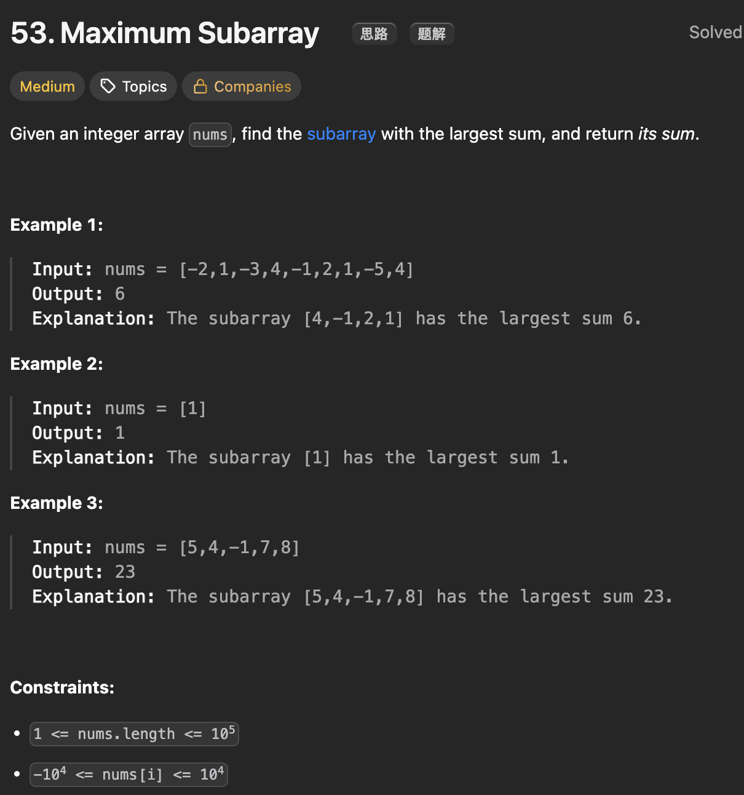

# LeetCode 53 - Maximum Subarray

**类型**：greedy, preSum, dynamic programming
**难度**：medium

---

## 一、题目描述（截图）



---

## 二、解题思路

1. 动态规划解法：dp[i]表示以nums[i]为结尾的最大子数组和，有两种选择，将nums[i]与之前的结合起来或者从nums[i]重新开始
2. 贪心解法：如果连续和为负数了那就重新开始找新的子数组
3. 前缀和解法：用前缀和直接的差值找最大子数组的和

## 三、正确解法

```java
// 动态规划解法
class Solution {
    public int maxSubArray(int[] nums) {
        // dp[i]表示以nums[i]为结尾的最大子数组和
        int n = nums.length;
        int[] dp = new int[n];

        // base case
        dp[0] = nums[0];
        int result = dp[0];
        for (int i = 1; i < n; i++) {
            dp[i] = Math.max(dp[i - 1] + nums[i], nums[i]);
            result = Math.max(result, dp[i]);
        }
        return result;
    }
}

// 贪心解法
class Solution {
    public int maxSubArray(int[] nums) {
        int result = Integer.MIN_VALUE;

        int count = 0;
        for (int num : nums) {
            count += num;

            result = Math.max(result, count);
            if (count <= 0) {
                count = 0;
            }
        }
        return result;
    }
}

// 前缀和解法
class Solution {
    public int maxSubArray(int[] nums) {
        int n = nums.length;
        int[] preSum = new int[n + 1];
        preSum[0] = 0;
        for (int i = 1; i <= n; i++) {
            preSum[i] = preSum[i - 1] + nums[i - 1];
        }

        int minVal = Integer.MAX_VALUE;
        int result = Integer.MIN_VALUE;
        for (int i = 0; i < n; i++) {
            // preSum[0...i - 1] 的最小值
            minVal = Math.min(minVal, preSum[i]);
            // 以nums[i]为结尾的最大子数组的和为preSum[i + 1] - min(preSum[0...i-1])
            result = Math.max(result, preSum[i + 1] - minVal);
        }
        return result;
    }
}
```

---

## 四、容易踩坑点

- [ ]
