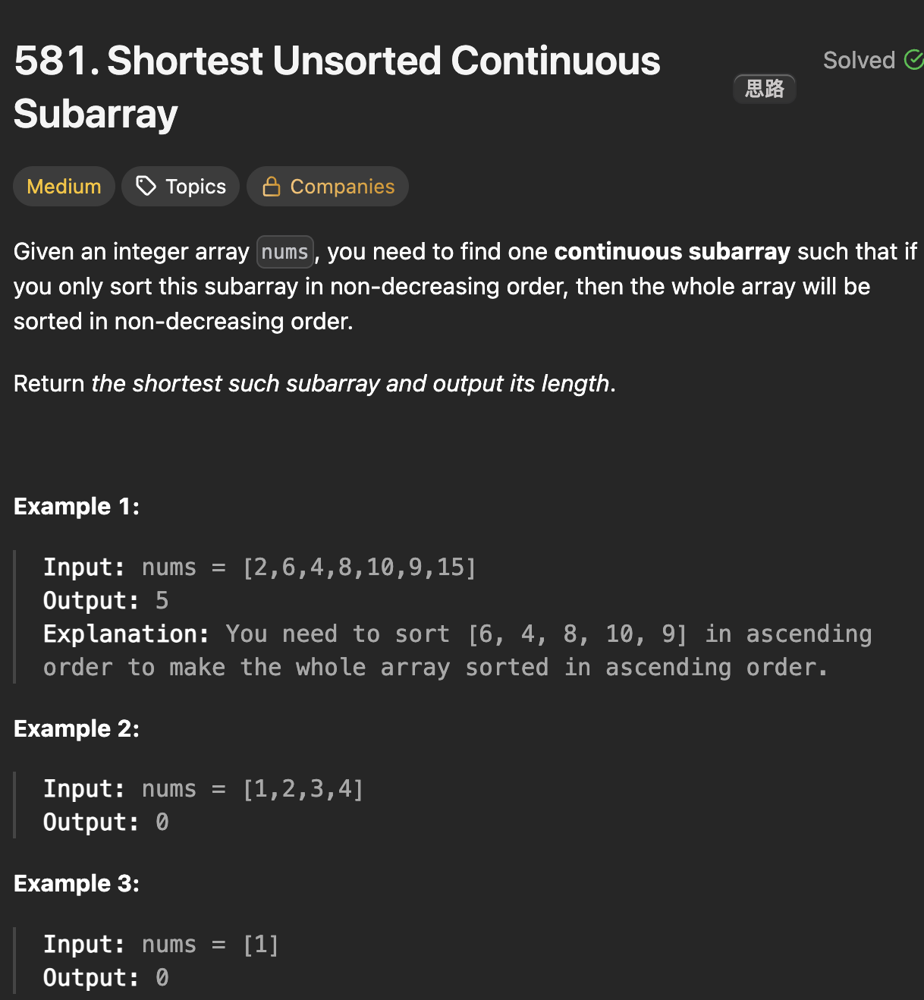

# LeetCode 581 - Shortest Unsorted Continous Subarray

**类型**：sorting, two pointer, stack
**难度**：medium
**错误次数**：2
**错误原因**：左边界寻找方法不对，其实应该和右边界寻找方法对称

---

## 一、题目描述（截图）



---

## 二、解题思路

1. 思路一：排序，通过排序发现不对的位置
2. 思路二：单调栈
3. 思路三：双指针寻找左右边界

## 三、正确解法

```java
// 思路一
class Solution {
    public int findUnsortedSubarray(int[] nums) {
        int[] temp = Arrays.copyOf(nums, nums.length);
        Arrays.sort(temp);
        int left = Integer.MAX_VALUE, right = Integer.MIN_VALUE;
        for (int i = 0; i < nums.length; i++) {
            if (temp[i] != nums[i]) {
                left = i;
                break;
            }
        }
        for (int i = nums.length - 1; i >= 0; i--) {
            if (temp[i] != nums[i]) {
                right = i;
                break;
            }
        }
        if (left == Integer.MAX_VALUE && right == Integer.MIN_VALUE) {
            return 0;
        }
        return right - left + 1;
    }
}
// 思路二
class Solution {
    public int findUnsortedSubarray(int[] nums) {
        int left = Integer.MAX_VALUE, right = Integer.MIN_VALUE;
        // 栈里放索引
        // 递增栈
        Deque<Integer> incrStack = new ArrayDeque<>();
        for (int i = 0; i < nums.length; i++) {
            while (!incrStack.isEmpty() && nums[incrStack.peek()] > nums[i]) {
                left = Math.min(left, incrStack.pop());
            }
            incrStack.push(i);
        }
        // 递减栈
        Deque<Integer> decrStack = new ArrayDeque<>();
        for (int j = nums.length - 1; j >= 0; j--) {
            while (!decrStack.isEmpty() && nums[decrStack.peek()] < nums[j]) {
                right = Math.max(right, decrStack.pop());
            }
            decrStack.push(j);
        }
        if (left == Integer.MAX_VALUE && right == Integer.MIN_VALUE) {
            return 0;
        }
        return right - left + 1;
    }
}
// 思路三
class Solution {
    public int findUnsortedSubarray(int[] nums) {
        int rightBound = 0;
        int min = nums[0];
        for (int i = 1; i < nums.length; i++) {
            if (nums[i] > min) {
                min = nums[i];
            } else if (nums[i] < min) {
                rightBound = i;
            }

        }
        int leftBound = nums.length;
        int max = nums[nums.length - 1];
        for (int j = nums.length - 2; j >= 0; j--) {
            if (nums[j] < max) {
                max = nums[j];
            } else if (nums[j] > max) {
                leftBound = j;
            }
        }
        return rightBound > leftBound ? rightBound - leftBound + 1 : 0;
    }
}
```

---

## 四、容易踩坑点

- [ ] 在寻找左边界的时候，误以为第一次出现乱序的点就是左边界的开始，在遇到有重复元素的时候这种方法就会出错
