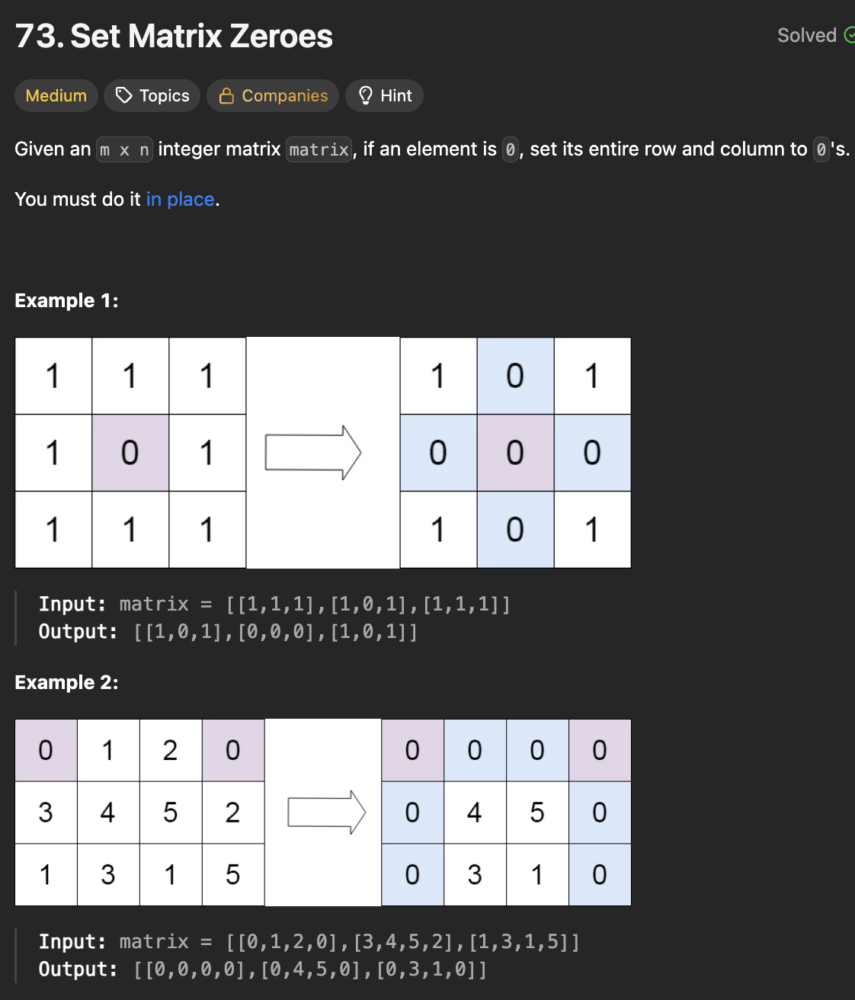

# LeetCode 73 - Set Matrix Zeroes

**类型**：array
**难度**：medium

---

## 一、题目描述（截图）



---

## 二、解题思路

1. 用m长度的数组来存储对应的列是否为0，n长度的数组来存储对应的行是否为0
2. 可以直接用原有数组的第一行和第一列来充当这两个存储结果的数组
3. 因为随着遍历的进行，前面的值并不会影响后面的值
4. 但是最上角的空格存在了重复，所以另需要一个值来保存第一行是否为0的值

## 三、正确解法

```java
class Solution {
    public void setZeroes(int[][] matrix) {
        int m = matrix.length, n = matrix[0].length;
        // matrix[0][]行表示对应的列是否为0
        // matrix[][0]列表示对应的行是否为0
        // firstRow 表示第一行是否为0
        boolean firstRow = false;

        for (int r = 0; r < m; r++) {
            for (int c = 0; c < n; c++) {
                if (matrix[r][c] == 0) {
                    matrix[0][c] = 0;
                    if (r > 0) {
                        matrix[r][0] = 0;
                    } else {
                        firstRow = true;
                    }
                }
            }
        }

        for (int r = 1; r < m; r++) {
            for (int c = 1; c < n; c++) {
                if (matrix[0][c] == 0 || matrix[r][0] == 0) {
                    matrix[r][c] = 0;
                }
            }
        }
        if (matrix[0][0] == 0) {
            for (int r = 0; r < m; r++) {
                matrix[r][0] = 0;
            }
        }
        if (firstRow) {
            for (int c = 0; c < n; c++) {
                matrix[0][c] = 0;
            }
        }
    }
}
```

---

## 四、容易踩坑点

- [ ] 在根据结果对原数组进行赋值时，需要先操作中间的空格，接着再处理第一列，最后再处理第一行
