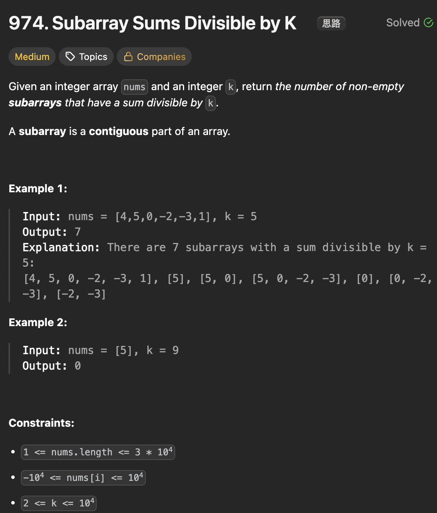

# LeetCode 974 - Subarray Sums Divisible by K

**类型**：prefixSum, hashmap
**难度**：medium
**错误次数**：2
**错误原因**：忘记往map里加一个余数为0的key，余数为负数没有正确处理

---

## 一、题目描述（截图）



---

## 二、解题思路

1. 利用前缀和的性质可以快速求出区间和，但在这里要利用前缀和模K的余数是否相等，如果两个前缀和模K的的余数相等，那么这两个前缀和的差就能被k整除

## 三、正确解法

```java
class Solution {
    public int subarraysDivByK(int[] nums, int k) {
        // sum[i,...,j - 1] = prefixSum[j] - prefixSum[i]
        // sum[i,...,j - 1] % k == 0 => (prefixSum[j] - prefixSum[i]) % k == 0 => prefixSum[j] % k == prefixSum[i] % k
        int n = nums.length;
        Map<Integer, Integer> remainderFreq = new HashMap<>();
        // 如果某个前缀和本身就能被k整除
        remainderFreq.put(0, 1);
        int[] prefixSum = new int[n + 1];
        int result = 0;
        for (int i = 1; i <= n; i++) {
            prefixSum[i] = prefixSum[i - 1] + nums[i - 1];
            // 前缀和若为负数，模k之后还是负数，需要将它转化为正数
            int remainder = (prefixSum[i] % k + k) % k;
            int currentCount = remainderFreq.getOrDefault(remainder, 0);
            result += currentCount;

            remainderFreq.put(remainder, currentCount + 1);
        }

        return result;
    }
}
```

---

## 四、容易踩坑点

- [ ] 用两个前缀和之差来表示某个区间和的公式不能表示从index0开始的区间，但是这个区间也可能被k整除，因此需要在map里加一个（0，1）的key-value对
- [ ] 如果前缀和为负数，比如为-1， k = 2, 那应该将它转化为整数1，其效果一致，因为如果另一个前缀和为1，而1-（-1）= 2%2=0
