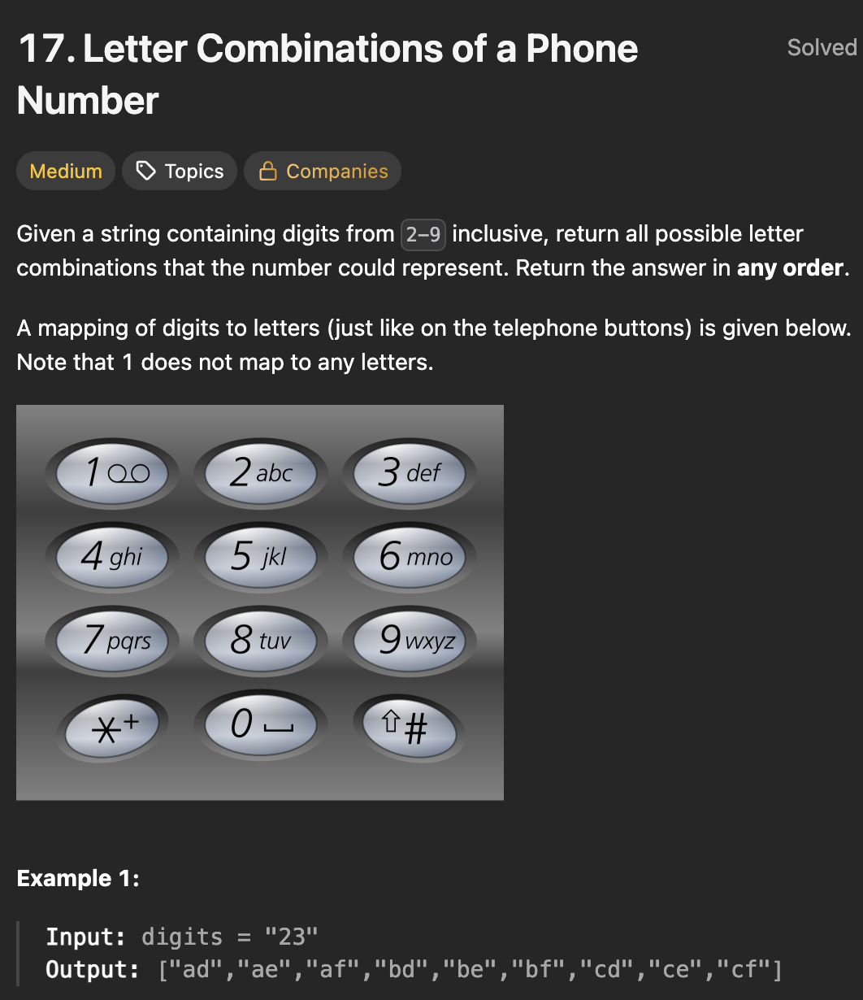

# LeetCode 17 - Letter Combinations of a Phone Number

**类型**：back tracking
**难度**：Medium
**错误原因**：加了外层循环，逻辑混乱

---

## 一、题目描述（截图）



---

## 二、解题思路

1. 回溯法: 决策树，每一层处理字符串的一个位置，树枝由该位置数字映射的所有字符决定
2. 迭代法: 一层一层构建字符串，每一层都在上一层的基础上增加一个字符

## 三、正确解法

```java
// 回溯法
class Solution {
    public List<String> letterCombinations(String digits) {
        String[] map = new String[]{"", "", "abc", "def", "ghi", "jkl",
        "mno", "pqrs", "tuv", "wxyz"};
        List<String> result = new ArrayList<>();
        StringBuilder sb = new StringBuilder();

        backtrack(digits, 0, map, sb, result);
        return result;
    }

    private void backtrack(String digits, int start, String[]map, StringBuilder sb, List<String> result) {
        if (start == digits.length()) {
            result.add(sb.toString());
            return;
        }

        int digit = digits.charAt(start) - '0';
        for (char c : map[digit].toCharArray()) {
                sb.append(c);
                backtrack(digits, start + 1, map, sb, result);
                sb.deleteCharAt(sb.length() - 1);
        }
    }
}
// 迭代法
class Solution {
    public List<String> letterCombinations(String digits) {
        String[] map = new String[]{"", "", "abc", "def", "ghi", "jkl",
        "mno", "pqrs", "tuv", "wxyz"};

        List<String> result = new ArrayList<>();
        result.add("");

        for (int i = 0; i < digits.length(); i++) {
            int digit = digits.charAt(i) - '0';
            List<String> tempList = new ArrayList<>();
            for (String s : result) {
                for (char c : map[digit].toCharArray()) {
                    tempList.add(s + c);
                }
            }
            result = tempList;
        }

        return result;
    }
}
```

---

## 四、容易踩坑点

- [ ] 这里字符串的形成是一步步构建而来的，每一步都是必须的，因为不需要外层循环（即i从start遍历整个字符串）
