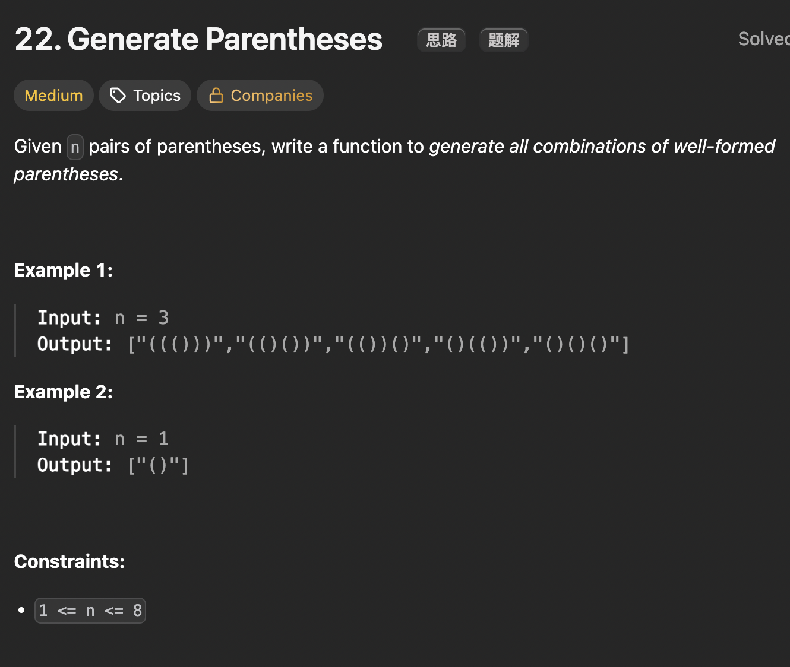

# LeetCode 22 - Generate Parentheses

**类型**：back tracking
**难度**：Medium
**错误次数**：2

---

## 一、题目描述（截图）



---

## 二、解题思路

1. 括号问题都要从以下两个性质出发：1） 左括号等于右括号数量 2）对于任何位置 0<= i < len(p), 字符串p[0,...,i]中左括号都大于右括号数
2. 本题相当于在 2\*n个位置放入左括号或右括号，可以用回溯算法穷举
3. 在穷举过程中筛选掉不满足性质的字符串

## 三、正确解法

```java
class Solution {
    public List<String> generateParenthesis(int n) {
        List<String> res = new ArrayList<>();
        StringBuilder path = new StringBuilder();

        backTrack(n, n, path, res);
        return res;
    }

    // left表示可用的左括号数量， right表示可用的右括号数量
    private void backTrack(int left, int right, StringBuilder path, List<String> res) {
        if (left > right) return;
        if (left < 0 || right < 0) return;
        if (left == 0 && right == 0) {
            res.add(path.toString());
        }

        // 选择放左括号
        path.append('(');
        backTrack(left - 1, right, path, res);
        path.deleteCharAt(path.length() - 1);

        // 选择放右括号
        path.append(')');
        backTrack(left, right - 1, path, res);
        path.deleteCharAt(path.length() - 1);
    }
}
```

---

## 四、容易踩坑点

- [ ] 回溯的过程中做完选择递归后需要回溯将选择撤销掉
