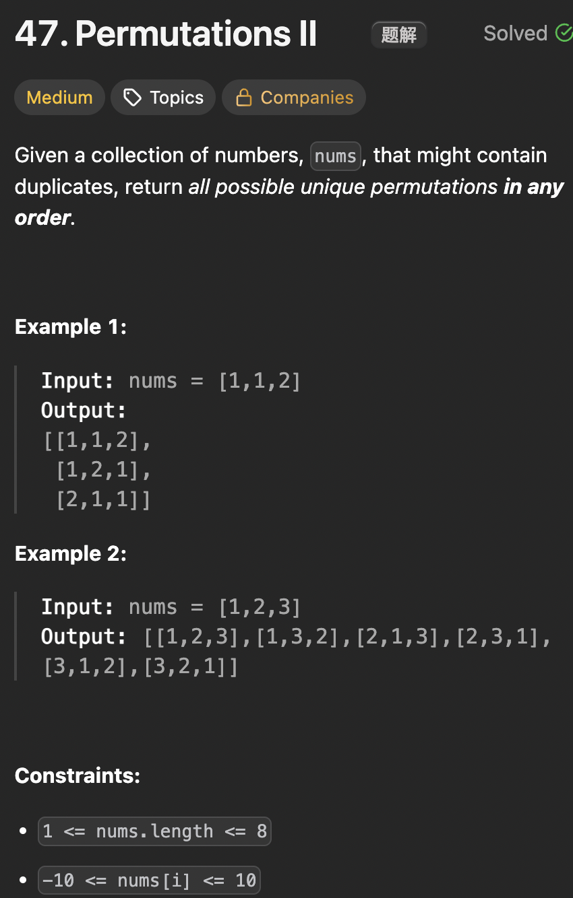

# LeetCode 47 - Permutations II

**类型**：back tracking
**难度**：Medium
**错误次数**：2

---

## 一、题目描述（截图）



---

## 二、解题思路

1. 用一个布尔数组used表示已经做过的选择
2. 去重思路：先对原数组进行排序，将相等的元素放在一起便于去重，去重条件是元素的相对位置必须固定

## 三、正确解法

```java
class Solution {
    public List<List<Integer>> permuteUnique(int[] nums) {
        Arrays.sort(nums);
        List<List<Integer>> result = new ArrayList<>();
        List<Integer> path = new ArrayList<>();
        boolean[] used = new boolean[nums.length];

        backTrack(nums, path, result, used);
        return result;
    }

    private void backTrack(int[] nums, List<Integer> path, List<List<Integer>> result, boolean[] used) {
        if (path.size() == nums.length) {
            result.add(new ArrayList<>(path));
        }
        for (int i = 0; i < nums.length; i++) {
            if (used[i]) continue;
            // 保持元素的相对位置固定，比如[1, 2, 2']
            // 2->2',选了2才能选2‘，这样就不会出现2’->2 导致重复的排列
            if (i > 0 && nums[i] == nums[i - 1] && !used[i - 1]) {
                continue;
            }
            path.add(nums[i]);
            used[i] = true;
            backTrack(nums, path, result, used);
            path.removeLast();
            used[i] = false;
        }
    }
}
```

---

## 四、容易踩坑点

- [ ] 去重时，是nums[i] == nums[i - 1] && ！used[i - 1], 这样才能保证相同元素的相对位置固定
