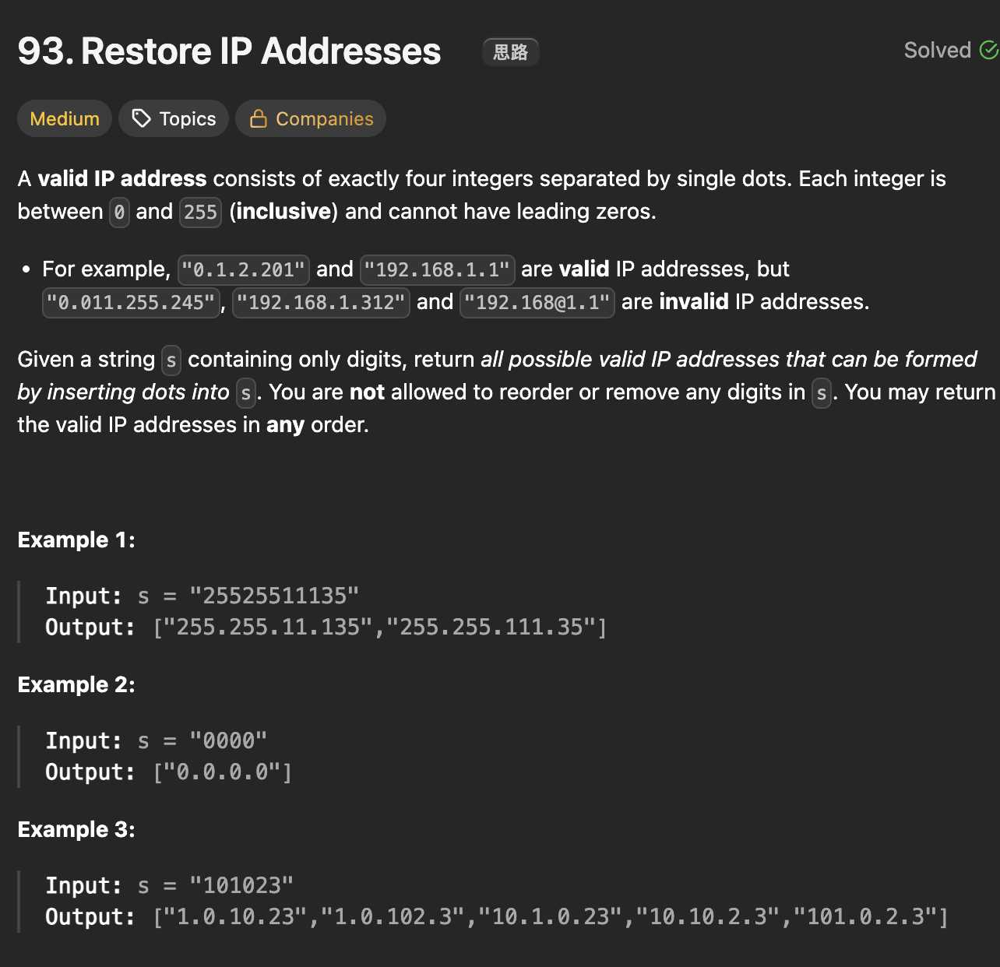

# LeetCode 93 - Restore IP Addresses

**类型**：back tracking
**难度**：Medium

---

## 一、题目描述（截图）



---

## 二、解题思路

1. 在字符串中插入三个dots即将字符串分割成四部分，每部分要满足[0, 255]
2. 在每个字符位置只有三种长度选择，1， 2或者3
3. 自然地想到用回溯法来探索所有可能的路径

## 三、正确解法

```java
class Solution {
    List<String> result = new LinkedList<>();
    List<String> segments = new LinkedList<>();

    public List<String> restoreIpAddresses(String s) {
        backtrack(s, 0);
        return result;
    }

    private void backtrack(String s, int start) {
        if (segments.size() == 4) {
            if (start == s.length()) {
                // 这里不能破坏track的结构，因为后面有回溯
                result.add(String.join(".", segments));
            }
            return;
        }

        // 优化剪枝, 剩下的字符太多
        int remainLen = s.length() - start;
        int remainSegments = 4 - segments.size();
        if (remainLen > remainSegments * 3 || remainLen < remainSegments) {
            return;
        }
        // 只有三种长度选择（1， 2， 3）
        for (int i = start; i < Math.min(start + 3, s.length()); i++) {
            if (isValid(s, start, i)) {
                segments.addLast(s.substring(start, i + 1));
                backtrack(s, i + 1);
                segments.removeLast();
            }
        }
    }

    private boolean isValid(String s, int start, int end) {
        int len = end - start + 1;
        if (len > 1 && s.charAt(start) == '0') {
            return false;
        }
        int num = 0;
        for (int i = start; i <= end; i++) {
            char c = s.charAt(i);
            int digit = c - '0';
            num = num * 10 + digit;
        }

        return num <= 255;
    }
}
```

---

## 四、容易踩坑点

- [ ] 在收结果的时候不能把现有的结果结构破坏了，这样会影响后面的回溯动作
