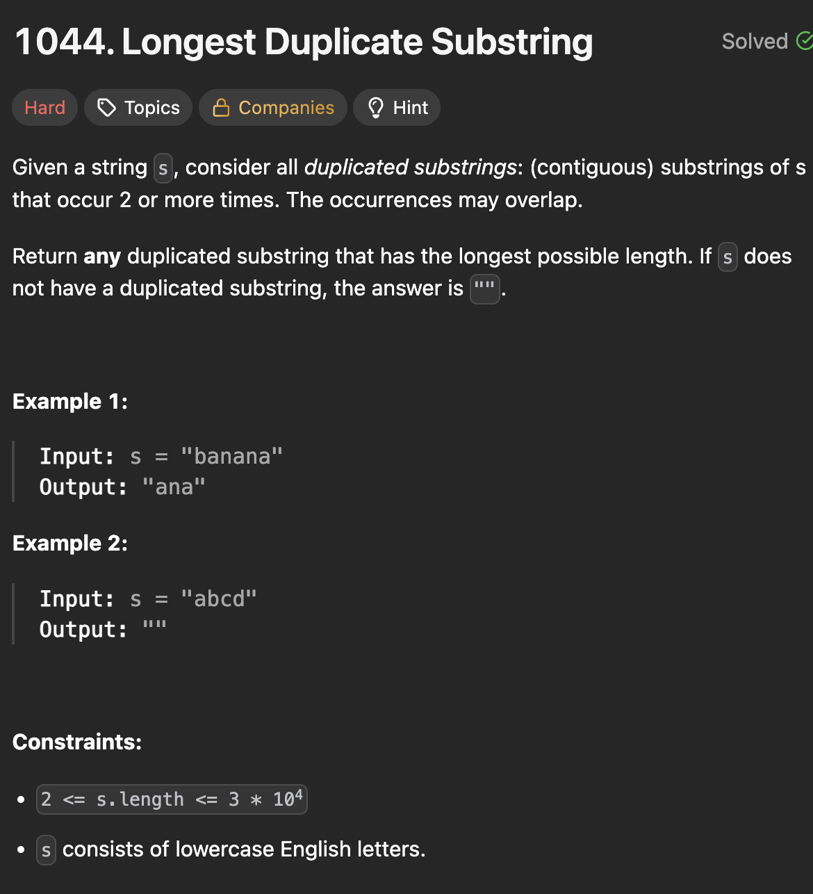

# LeetCode 1044 - Longest Duplicate Substring

**类型**：binary search + prefixHash
**难度**：hard

---

## 一、题目描述（截图）



---

## 二、解题思路

1. 重复子串的长度存在单调性，比如如果存在长度为k，那k-1, k-2,...是重复子串的长度，如果长度k+1不是重复子串，那往上也都不是，因此可以用二分法搜索长度。
2. 找到一个长度，在所有这个长度的子串里搜索是否有重复子串，如果有就找到满足条件的一个长度，再搜索更长的长度
3. 对于查找是否有重复子串，可以用hashSet，用prefix hash来加快hash

## 三、正确解法

```java
class Solution {
    private long[] basePowers;
    private long[] prefixHash;

    public String longestDupSubstring(String s) {
        final int BASE = 131;
        int n = s.length();

        basePowers = new long[n + 10];
        prefixHash = new long[n + 10];
        basePowers[0] = 1;
        for (int i = 0; i < n; i++) {
            basePowers[i + 1] = basePowers[i] * BASE;
            prefixHash[i + 1] = prefixHash[i] * BASE + s.charAt(i);
        }

        // Binary search template
        int left = 1;
        int right = n - 1;
        int firstTrueIndex = -1;
        String longestDuplicate = "";

        // Find first length where no duplicate exists
        while (left <= right) {
            int mid = left + (right - left) / 2;
            String duplicateFound = checkDuplicateOfLength(s, mid);

            if (duplicateFound.isEmpty()) {
                // No duplicate at this length
                firstTrueIndex = mid;
                right = mid - 1;
            } else {
                longestDuplicate = duplicateFound;
                left = mid + 1;
            }
        }
        return longestDuplicate;
    }

    private String checkDuplicateOfLength(String s, int length) {
        int n = s.length();
        Set<Long> seenHashes = new HashSet<>();

        for (int startPos = 1; startPos + length - 1 <= n; startPos++) {
            int endPos = startPos + length - 1;
            long hashValue = prefixHash[endPos] - prefixHash[startPos - 1] * basePowers[endPos - startPos + 1];

            if (seenHashes.contains(hashValue)) {
                return s.substring(startPos - 1, endPos);
            }
            seenHashes.add(hashValue);
        }
        return "";
    }
}
```

---

## 四、容易踩坑点

- [ ] 这里prefixHash的原理和prefixSum类似，prefixHash[i]表示前i个字符的
