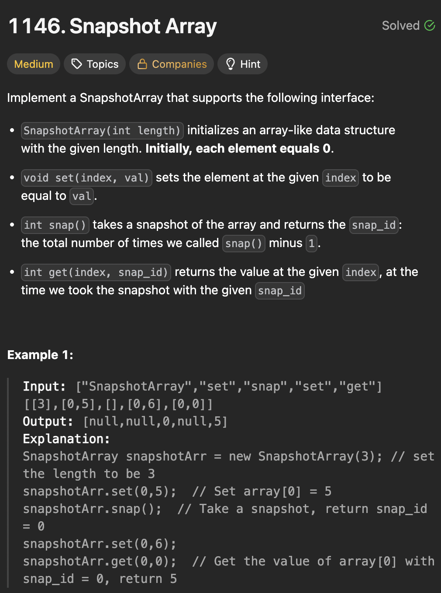

# LeetCode 1146 - Snapshot Array

**类型**：binary search
**难度**：Medium

---

## 一、题目描述（截图）



---

## 二、解题思路

1. 用一个list的array记录每个index的变化
2. 最近变化的那个值就是get函数要找的值

## 三、正确解法

```java
class SnapshotArray {
    private List<int[]>[] snapHistory;
    private int currentSnapId;

    public SnapshotArray(int length) {
        snapHistory = new List[length];
        Arrays.setAll(snapHistory, index -> new ArrayList<>());
        currentSnapId = 0;
    }

    public void set(int index, int val) {
        snapHistory[index].add(new int[]{currentSnapId, val});
    }

    public int snap() {
        return currentSnapId++;
    }

    public int get(int index, int snap_id) {
        // 在snapHistory对应的索引位置里找到最右边小于等于snap_id的id
        int left = 0;
        int right = snapHistory[index].size();

        // 找到第一个大于snap_id的id
        while (left < right) {
            int mid = left + (right - left) / 2;

            if (snapHistory[index].get(mid)[0] > snap_id) {
                right = mid;
            } else {
                left = mid + 1;
            }
        }
        // left是第一个大于snap_id的id,我们要找最后一个小于等于snap_id的，所以要往前一个
        left--;
        return left < 0 ? 0 : snapHistory[index].get(left)[1];
    }
}
```

---

## 四、容易踩坑点

- [ ] 为了避免死循环并且mid采用向下取整的基本范式，这里先找到第一个大于snap_id的id再往前找一个
