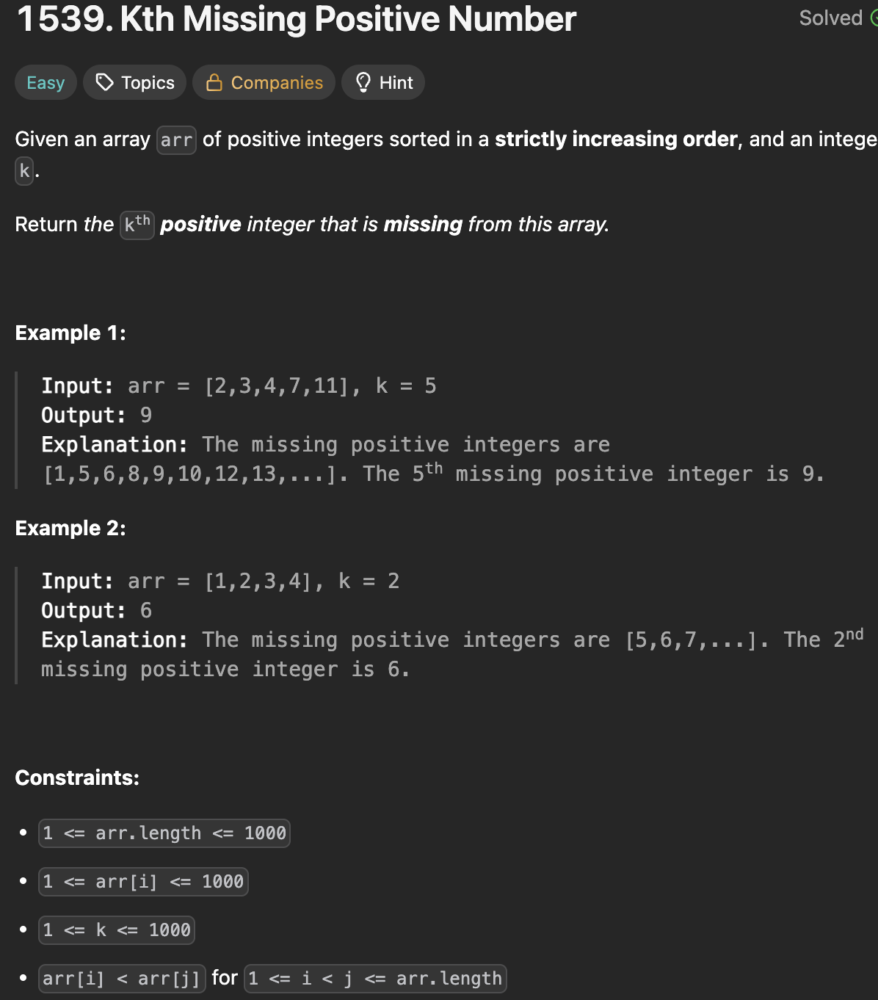

# LeetCode 1539 - Kth Missing Positive Number

**类型**：binary search
**难度**：Easy
**错误次数**：1
**错误原因**：循环结束时left,right代表的意思

---

## 一、题目描述（截图）



---

## 二、解题思路

1. 每个位置都能算出到目前位置错过的正整数个数
2. 通过二分法可以加快搜索效率，如果缺少的个数小于k那就要往右区间搜索，反之往左区间搜索
3. 循环结束时，left停留在第一个缺少个数大于等于k的位置，而right停留在最后一个缺少个数小于k的位置

## 三、正确解法

```java
class Solution {
    public int findKthPositive(int[] arr, int k) {
        int left = 0, right = arr.length - 1;
        while (left <= right) {
            int mid = left + (right - left) / 2;
            // 按顺序mid位置的值应该是mid + 1
            // 与arr[mid]的差值就是miss的个数
            int miss = arr[mid] - (mid + 1);

            // 如果缺失个数小于k，说明第k个缺失的数在右边
            if (miss < k) {
                left = mid + 1;
            }
            // 如果缺失个数大于或等于k，都往左边收缩
            // 循环结束时，left停在第一个miss >= k 的位置
            else {
                right = mid - 1;
            }
        }

        // 数学关系：
        // 结果 = arr[right] + (k - miss_at_right)
        //      = arr[right] + k - (arr[right] - (right + 1))
        //      = k + right + 1
        //因为循环结束时 left = right + 1,所以直接返回k + left
        return k + left;
    }
}
```

---

## 四、容易踩坑点

- [ ] 当miss的个数等于k时不能直接返回，因为可能存在多个这样的位置，比如[2, 3, 4],每个位置miss的个数都是1，因此要找到第一个这样的位置
