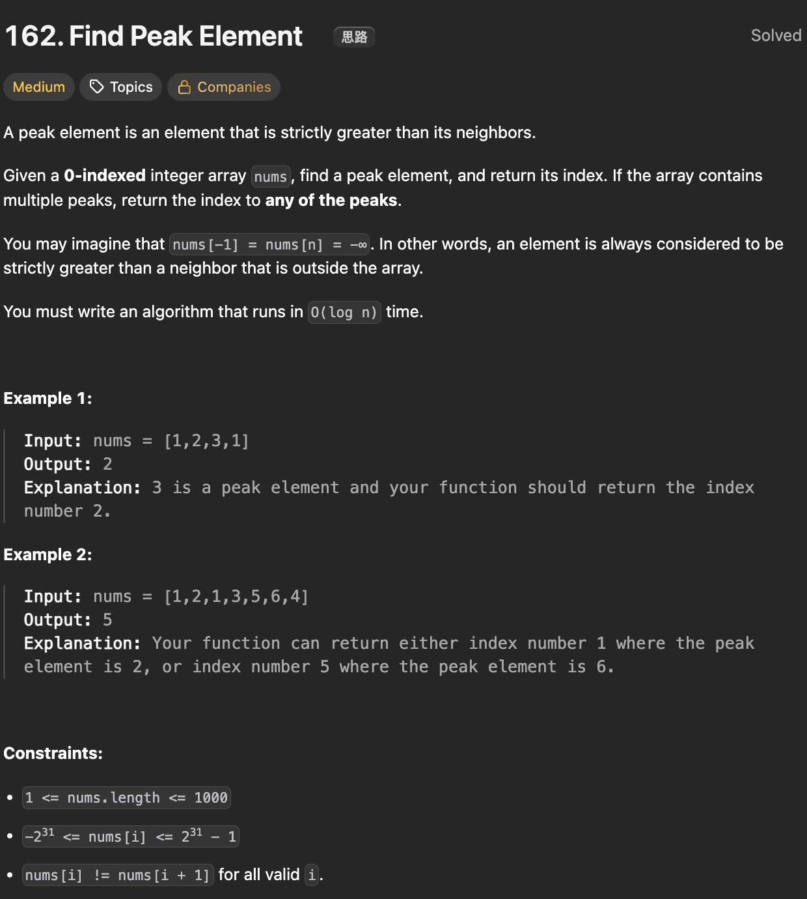

# LeetCode 162 - Find Peak Element

**类型**：binary search
**难度**：Medium
**错误次数**：1

---

## 一、题目描述（截图）



---

## 二、解题思路

1. 二分搜索，对比nums[mid] 和 nums[mid + 1],如果是上坡，mid可能是峰值或者右边存在一个峰值，如果是下坡，那峰值就在左边区域

## 三、正确解法

```java
class Solution {
    public int findPeakElement(int[] nums) {
        int left = 0, right = nums.length - 1;

        while (left < right) {
            int mid = left + (right - left) / 2;
            if (nums[mid] > nums[mid + 1]) {
                right = mid;
            } else if (nums[mid] < nums[mid + 1]){
                left = mid + 1;
            }
        }
        return left;
    }
}
```

---

## 四、容易踩坑点

- [ ]
