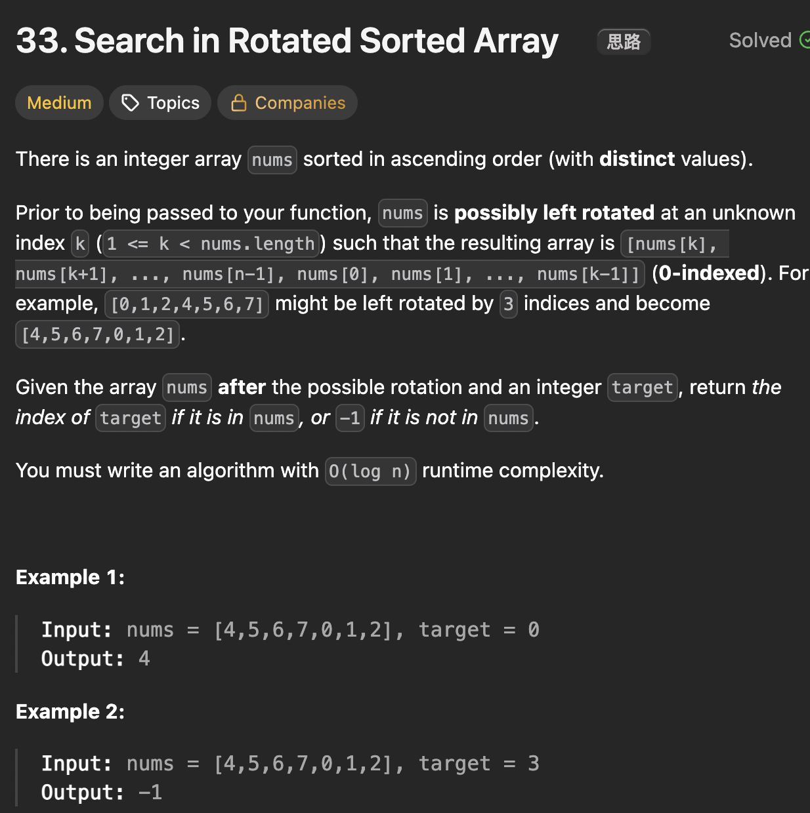

# LeetCode 33 - Search In Rotated Sorted Array

**类型**：binary search
**难度**：Medium
**错误次数**：2

---

## 一、题目描述（截图）



---

## 二、解题思路

1. 因为数组被分成了两段有序的数组，所以先要判断mid位置处在左侧有序数组还是右侧有序数组

## 三、正确解法

```java
class Solution {
    public int search(int[] nums, int target) {
        int left = 0, right = nums.length - 1;
        // 结束条件为 left > right
        while (left <= right) {
            int mid = left + (right - left) / 2;
            if (nums[mid] == target) {
                return mid;
            }
            // 判断mid中点落在断崖左侧还是右侧
            if (nums[mid] >= nums[left]) {
                // mid落在断崖左边，此时nums[left...mid]有序
                // target < nums[left] || target > nums[mid]
                if ( target >= nums[left] && target < nums[mid]) {
                    right = mid - 1;
                } else {
                    left = mid + 1;
                }
            } else {
                // mid落在断崖右边，此时nums[mid...right]有序
                if (target > nums[mid] && target <= nums[right]) {
                    left = mid + 1;
                } else {
                    right = mid - 1;
                }
            }
        }

        // while结束还没找到，说明target 不存在
        return -1;
    }
}
```

---

## 四、容易踩坑点

- [ ] 注意判断条件里的等号，比如nums[mid] >= nums[left]，mid是有可能和left重复的
