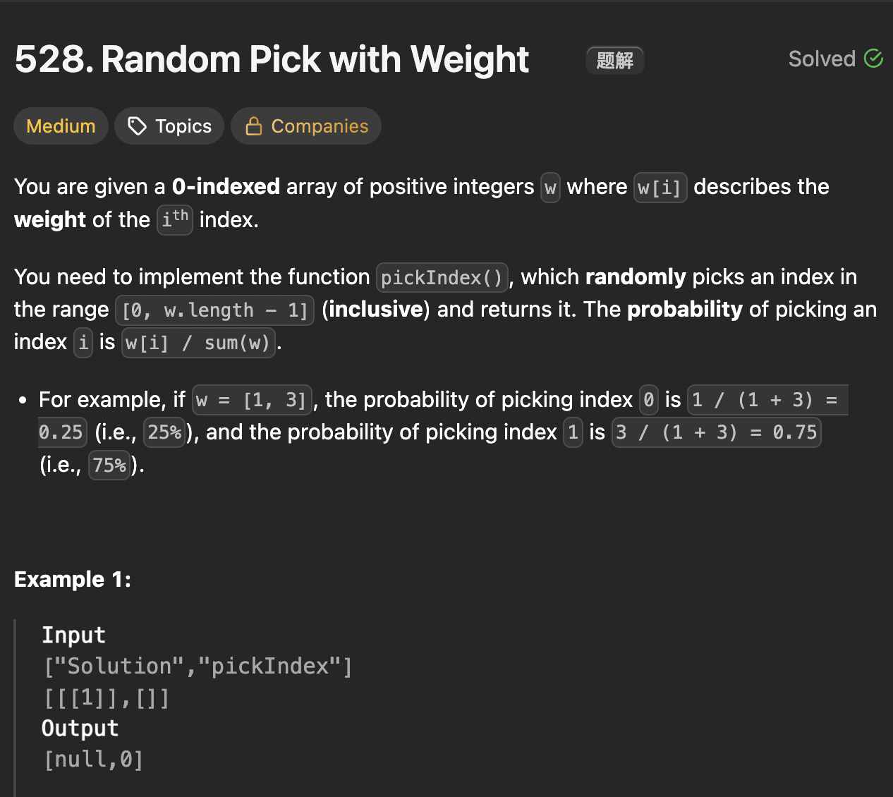

# LeetCode 528 - Random Pick With Weight

**类型**：binary search
**难度**：Medium
**错误次数**：1

---

## 一、题目描述（截图）



---

## 二、解题思路

1. 带权重的随机选择可以转换为一定比例的线段区间选择问题
2. 用前缀和表示线段长度，随机生成这个长度内的一个数然后看它落在哪个区间

## 三、正确解法

```java
class Solution {
    private int[] preSum;
    private Random rand = new Random();


    public Solution(int[] w) {
        int n = w.length;
        preSum = new int[n + 1];
        for (int i = 1; i <= n; i++) {
            preSum[i] = preSum[i - 1] + w[i - 1];
        }
    }

    public int pickIndex() {
        int n = preSum.length;
        // java的nextInt(n)在[0, n）中随机生成一个数
        // 加上1就变成[1, presum[n - 1]] 中的一个数
        int target = rand.nextInt(preSum[n - 1]) + 1;

        // preSum的index第0位是占位符，比w的index多了一位
        return leftBound(preSum, target) - 1;
    }

    // 二分搜索查找比目标值大的最小索引
    private int leftBound(int[] preSum, int target) {
        int left = 1, right = preSum.length - 1;
        while (left < right) {
            int mid = left + (right - left) / 2;
            if (preSum[mid] >= target) {
                right = mid;
            } else if (preSum[mid] < target) {
                left = mid + 1;
            }
        }
        return left;
    }
}
```

---

## 四、容易踩坑点

- [ ] target的取值范围应该是[w[0], preSum[len - 1]]
- [ ] preSum的索引第一位是占位符，所有比原数组中的索引要大一位
