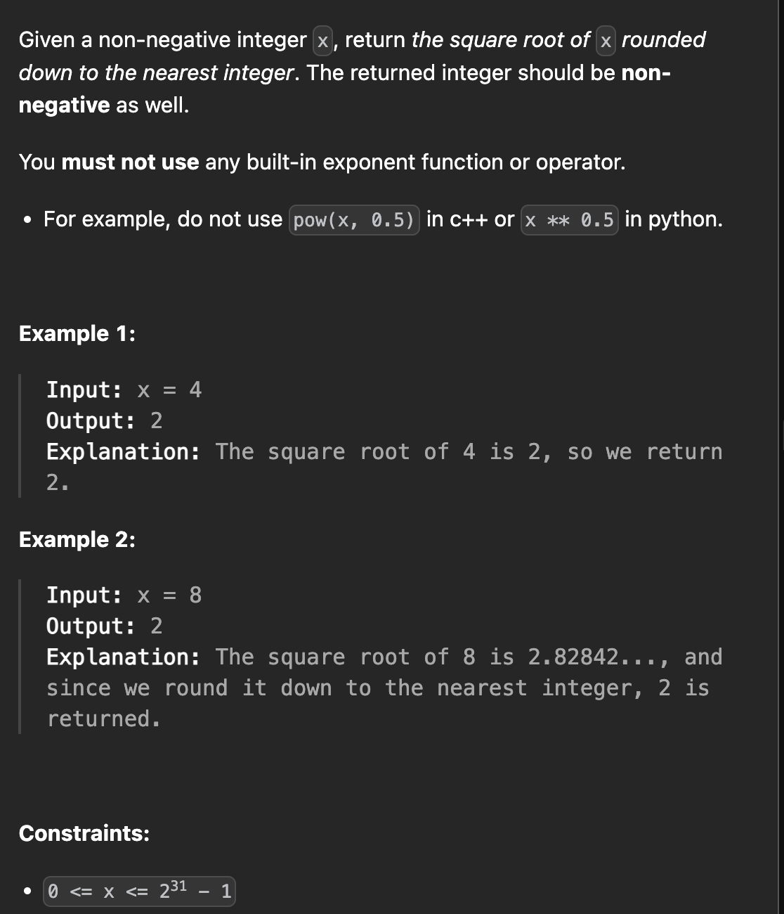

# LeetCode 69 - Sqrt(x)

**类型**：binary search
**难度**：Easy
**错误次数**：1
**错误原因**：overflow 对于 large x

---

## 一、题目描述（截图）



---

## 二、解题思路

1. 用二分法加快搜索效率

## 三、正确解法

```java
class Solution {
    public int mySqrt(int x) {
        if (x == 0) return 0;
        // 这里当x较大时，i * i 会造成溢出，需要将类型调整为long
        for (long i = 1; i <= x / 2 + 1; i++) {
            if (i * i == x) {
                return (int)i;
            } else if (i * i > x) {
                return (int)i - 1;
            }
        }
        return 1;
    }
}

// better solustion, binary search
class Solution {
    public int mySqrt(int x) {
        if (x == 0) return 0;
        long left = 1, right = x / 2 + 1;
        while (left <= right){
            long mid = left + (right - left) / 2;
            long square = mid * mid;
            if (square == x) {
                return (int)mid;
            } else if (square < x) {
                left = mid + 1;
            } else if (square > x) {
                right = mid - 1;
            }
        }

        return (int)right;
    }
}
```

---

## 四、容易踩坑点

- [ ]
