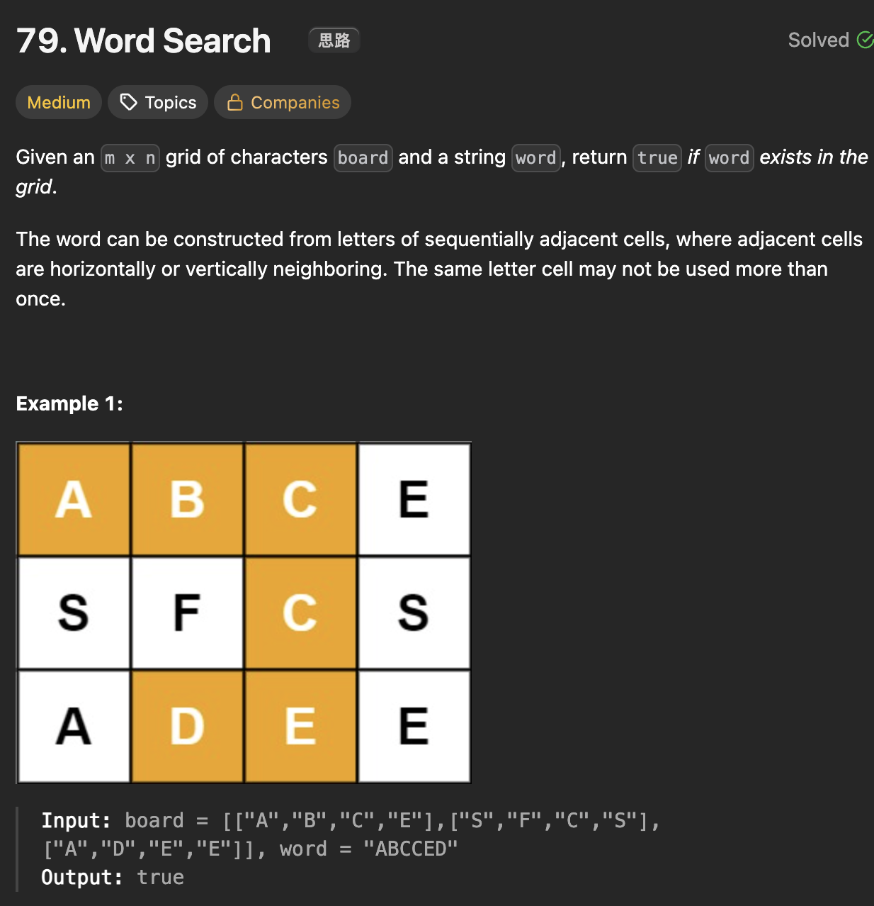

# LeetCode 79 - Word Search

**类型**：Depth first search
**难度**：medium

---

## 一、题目描述（截图）



---

## 二、解题思路

1. 这道题没有高效的解法，只有暴力穷举
2. board上每个位置都有可能是这个word的开始，因此需要两层循环去探索所有可能性
3. 如果遇到某个位置match了，再从这个位置的四个方向展开搜索下一个字符
4. 在当前路径上不能重复使用已经走过的字符

## 三、正确解法

```java
lass Solution {
    private boolean found = false;
    public boolean exist(char[][] board, String word) {
        int m = board.length, n = board[0].length;

        // explore every possibility
        for (int row = 0; row < m; row++) {
            for (int col = 0; col < n; col++) {
                dfs(board, row, col, word, 0);
                if (found) {
                    return true;
                }
            }
        }
        return false;
    }

    private void dfs(char[][] board, int row, int col, String word, int index) {
        if (found) return;
        if (index == word.length()) {
            found = true;
            return;
        }

        if (row < 0 || row >= board.length || col < 0 || col >= board[0].length ||board[row][col] == '0' || word.charAt(index) != board[row][col]) {
            return;
        }

        char temp = board[row][col];
        board[row][col] = '0';
        dfs(board, row - 1, col, word, index + 1);
        dfs(board, row, col + 1, word, index + 1);
        dfs(board, row + 1, col, word,index + 1);
        dfs(board, row, col - 1, word, index + 1);
        board[row][col] = temp;
    }
}
```

---

## 四、容易踩坑点

- [ ] 如何标记当前路径已经走过的字符，边界条件放在递归前判断代码更清晰
