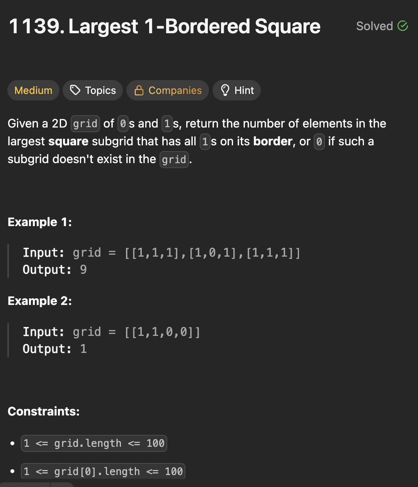

# LeetCode 1139 - Largest 1Boared Square

**类型**：dynamic programming
**难度**：Medium
**错误次数**：1

---

## 一、题目描述（截图）



---

## 二、解题思路

1. 因为是要求边界都是1，即正方形四条边上的值都是1
2. 可以从右下角往左和往上延伸看有多少连续的1
3. 用动态规划求解这个连续1的长度
4. 再搜索所有可能的的边长

## 三、正确解法

```java
class Solution {
    public int largest1BorderedSquare(int[][] grid) {
        // 从右下角这个点开始往上看有多少个连续的1， 往左看多少个连续的1
        // 右下角往左看的最左边再往上看有多少个连续的1
        // 右下角往上看的最上边再往左看有多少个连续的1
        // 即找出网格中所有的点往左看和往上看有多少个连续的1
        int m = grid.length, n = grid[0].length;
        int[][] top = new int[m][n];
        int[][] left = new int[m][n];
        // 用动态规划计算出连续1的长度
        for (int i = 0; i < m; i++) {
            for (int j = 0; j < n; j++) {
                if (grid[i][j] == 1) {
                    top[i][j] = i > 0 ? top[i - 1][j] + 1 : 1;
                    left[i][j] = j > 0 ? left[i][j - 1] + 1 : 1;
                }
            }
        }

        // 从最大可能的边长开始搜索
        for (int a = Math.min(m, n); a > 0; a--) {
            // 从右下角开始搜索
            for (int i = m - 1; i + 1 >= a; i--) {
                for (int j = n - 1; j + 1 >= a; j--) {
                    // 看这个点往上往左构成的正方形是否满足要求
                    if (top[i][j] >= a && left[i][j] >= a && top[i][j - a + 1] >= a && left[i - a + 1][j] >= a) {
                        return a * a;
                    }
                }
            }
        }
        return 0;
    }
}
```

---

## 四、容易踩坑点

- [ ] 正方形四个角的索引，比如右下角是left[i][j], 左下角应该是top[i][j - a + 1]
