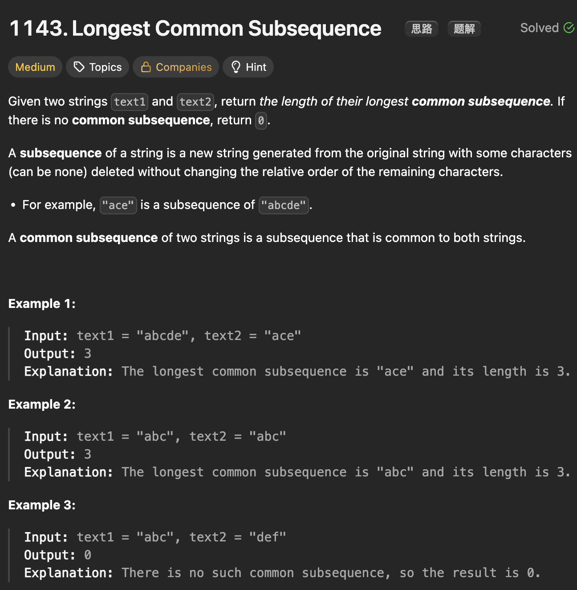

# LeetCode 1143 - Longest Common Subsequence

**类型**：dynamic programming
**难度**：Medium

---

## 一、题目描述（截图）



---

## 二、解题思路

1. 用两个指针分别游离在两个字符串上，挨个比较字符，如果相等，两个字符都是最长公共子序列的长度，若不相等那么可能其中某一个不是，需要进行取最大值比较
2. 从单个字符逐渐推导到整个字符串，因此可以用自顶向下加记忆的递归法或者自底向上的动态规划方法

## 三、正确解法

```java
// top down
class Solution {
    public int longestCommonSubsequence(String text1, String text2) {
        int m = text1.length(), n = text2.length();
        int[][] memo = new int[m][n];
        for (int[] row  : memo) {
            Arrays.fill(row, -1);
        }

        return dp(text1, 0, text2, 0, memo);
    }

    // 定义：计算s1[i...]和s2[j...]的最长公共子序列
    private int dp(String s1, int i, String s2, int j, int[][] memo) {
        // base case
        if (i == s1.length() || j == s2.length()) {
            return 0;
        }
        if (memo[i][j] != -1) {
            return memo[i][j];
        }
        if (s1.charAt(i) == s2.charAt(j)) {
            memo[i][j] = 1 + dp(s1, i + 1, s2, j + 1, memo);
        } else {
            memo[i][j] = Math.max(dp(s1, i + 1, s2, j, memo), dp(s1, i, s2, j+ 1, memo));
        }
        return memo[i][j];
    }
}

// bottom up
class Solution {
    public int longestCommonSubsequence(String text1, String text2) {
        // dp[i][j]表示s1[0,...,i-1] 和 s2[0,...,j-1]的最长公共子序列长度
        int m = text1.length(), n = text2.length();
        // 数组大小需要+1，因为要包含空字符串作为base case
        int[][] dp = new int[m + 1][n + 1];

        for (int i = 1; i <= m; i++) {
            for (int j = 1; j <= n; j++) {
                if (text1.charAt(i - 1) == text2.charAt(j - 1)) {
                    // dp的i和j对应字符串的i-1和j-1
                    dp[i][j] = 1 + dp[i - 1][j - 1];
                } else {
                    dp[i][j] = Math.max(dp[i][j - 1], dp[i - 1][j]);
                }
            }
        }
        return dp[m][n];
    }
}
```

---

## 四、容易踩坑点

- [ ]
