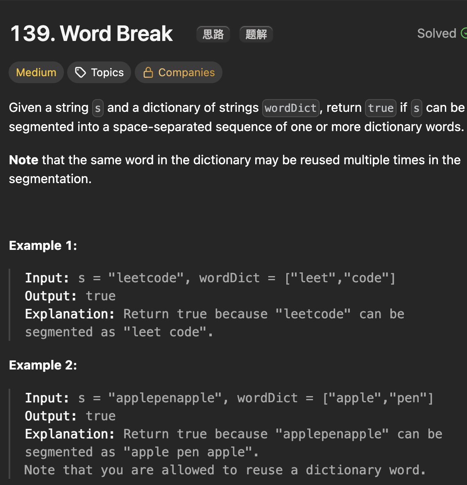

# LeetCode 139 - Word Break

**类型**：dynamic programming
**难度**：Medium
**错误次数**：2
**错误原因**：回溯和深搜递归混乱，如果dfs函数只传参数那不需要回溯，因为没有状态共享，参数会自动回溯

---

## 一、题目描述（截图）



---

## 二、解题思路

1. 分解问题思路，如果能在单词列表中找到一个单词匹配s[0,...,k], 那么只要能拼出s[k+1,...], 这就把wordBreak（s[0...]）分解成了规模较小的子问题wordBreak(s[k+1...]), 通过子问题的反推能推出原问题的解

## 三、正确解法

```java
// top down
class Solution {

    public boolean wordBreak(String s, List<String> wordDict) {
        Set<String> wordSet = new HashSet<>(wordDict);
        Boolean[] memo = new Boolean[s.length()];
        return dfs(s, wordSet, 0, memo);
    }
    // if s[startIndex, ..., s.len -1] 可以匹配
    private boolean dfs(String s, Set<String> wordSet, int startIndex, Boolean[] memo) {
        if (startIndex == s.length()) {
            return true;
        }
        if (memo[startIndex] != null) return memo[startIndex];
        // 遍历s[i,...]的所有前缀
        for (int end = startIndex + 1; end <= s.length(); end++) {
            String prefix = s.substring(startIndex, end);
            if (wordSet.contains(prefix)) {
                // 错误发生点，这里不能直接返回dfs(s, wordSet, end, memo)
                // 某一个prefix成功了不一定代表整条路径是成功的，还需要尝试下一个prefix
                if (dfs(s, wordSet, end, memo)) {
                    memo[startIndex] = true;
                    return true;
                }
            }
        }
        memo[startIndex] = false;
        return false;
    }
}

// bottom up
class Solution {
    public boolean wordBreak(String s, List<String> wordDict) {
        Set<String> wordSet = new HashSet<>(wordDict);
        int len = s.length();

        // dp[i] 表示substring[0,...,i-1]是否能被划分
        boolean[] dp = new boolean[len + 1];
        // 表示空串
        dp[0] = true;

        // dp[i]取决于dp[0, j]以及[j,...,i - 1]是否在wordSet里
        for (int endIndex = 1; endIndex <= len; endIndex++) {
            for (int startIndex = 0; startIndex < endIndex; startIndex++) {
                if (dp[startIndex] && wordSet.contains(s.substring(startIndex, endIndex))) {
                    dp[endIndex] = true;
                    break;
                }
            }
        }
        return dp[len];
    }
}
```

---

## 四、容易踩坑点

- [ ] top down 的方法会产生很多重复计算，需要memo来优化效率
