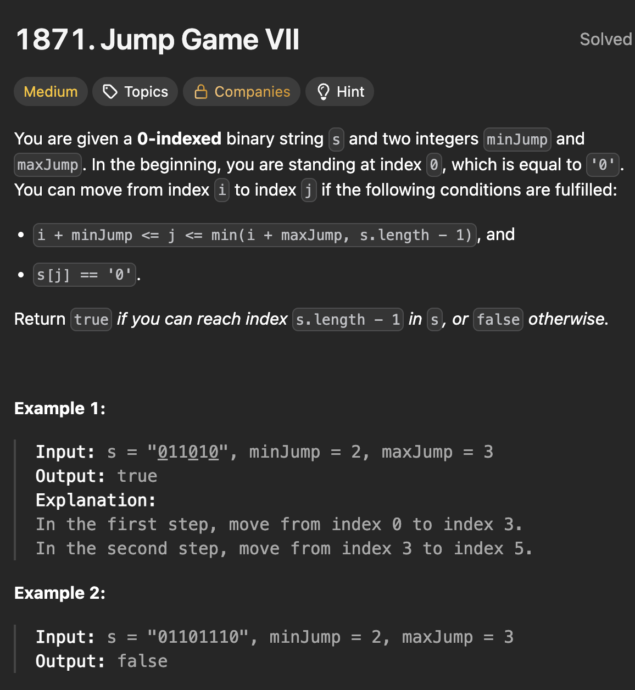

# LeetCode 1871 - Jump Game VII

**类型**：dynamic programming, prefixSum
**难度**：Medium
**错误次数**：1

---

## 一、题目描述（截图）



---

## 二、解题思路

1. 对于每个位置i，首先要检查这个位置是不是0，然后看看有没可能从之前的某个可达到的位置跳过来
2. 而这个位置需要满足的条件是落在[i - maxJump, i - minJump]区间里
3. 用prefixSum优化，prefixSum[i]表示前i个位置里可达到的位置的总数

## 三、正确解法

```java
class Solution {
    public boolean canReach(String s, int minJump, int maxJump) {
        int len = s.length();
        boolean[] isReachable = new boolean[len];
        int[] prefixSum = new int[len + 1];
        isReachable[0] = true;
        prefixSum[1] = 1;

        for (int i = 1; i < len; i++) {
            if (s.charAt(i) == '0') {
                int leftBound = Math.max(0, i - maxJump);
                int rightBound = i - minJump;

                isReachable[i] = rightBound >= leftBound && prefixSum[rightBound + 1] - prefixSum[leftBound] > 0;
            }
            prefixSum[i + 1] = prefixSum[i] + (isReachable[i] ? 1 : 0);
        }
        return isReachable[len - 1];
    }
}
```

---

## 四、容易踩坑点

- [ ] prefixSum[rightBound + 1] - prefixSum[leftBound] 表示[leftBound, rightBound]这个区间的可达位置数量
