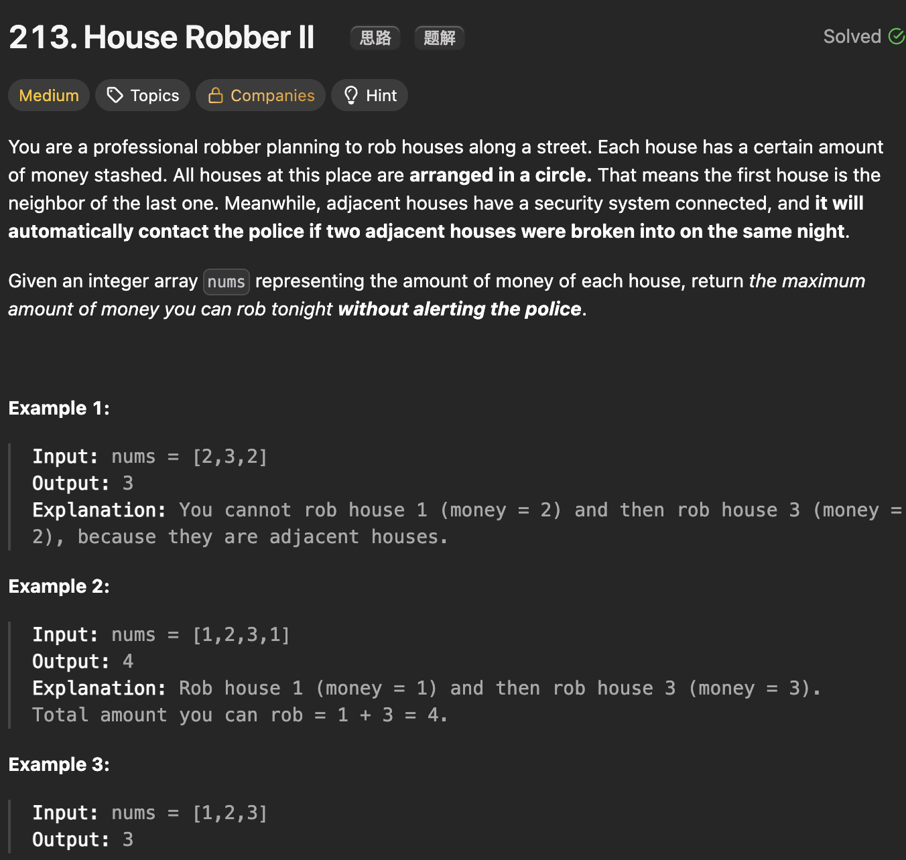

# LeetCode 213 - House RobberII

**类型**：dynamic programming
**难度**：Medium
**错误原因**：状态想复杂了

---

## 一、题目描述（截图）



---

## 二、解题思路

1. 房子首尾相邻，可以分情况讨论，最多有三种情况：首尾房子都不被抢；第一间房子被抢最后一间不被抢；第一间房子不被抢最后一间被抢
2. 因为房子里的钱都是非负数，第二三种情况选择范围更大，因此只比较第二三种情况即可

## 三、正确解法

```java
class Solution {
    public int rob(int[] nums) {
        int n = nums.length;
        if (n == 1) return nums[0];
        return Math.max(robRange(nums, 0, n - 2), robRange(nums, 1, n - 1));
    }


    // 返回[start,end]区间能抢到的最大值
    private int robRange(int[] nums, int start, int end) {
        int dp_i_1 = 0;
        int dp_i_2 = 0;
        int dp_i = 0;
        for (int i = end; i >= start; i--) {
            dp_i = Math.max(dp_i_1, dp_i_2 + nums[i]);
            dp_i_2 = dp_i_1;
            dp_i_1 = dp_i;
        }
        return dp_i;
    }
}
```

---

## 四、容易踩坑点

- [ ]
