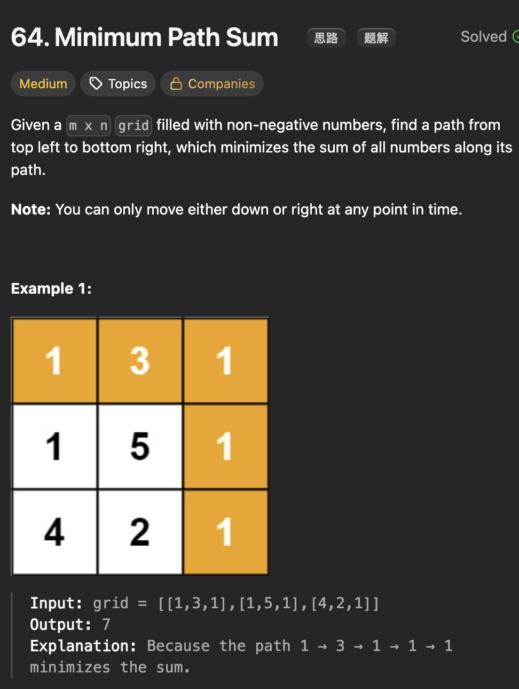

# LeetCode 64 - Minimum Path Sum

**类型**：dynamic programming
**难度**：Medium

---

## 一、题目描述（截图）



---

## 二、解题思路

1. 在二维矩阵中求最优问题，要想到动态规划技巧

## 三、正确解法

```java
// 自顶向下
class Solution {
    public int minPathSum(int[][] grid) {
        int m = grid.length;
        int n = grid[0].length;

        int[][] memo = new int[m][n];
        for (int[] row : memo) {
            Arrays.fill(row, -1);
        }

        return dp(grid, m - 1, n - 1, memo);
    }

    // 返回从左上角到位置(i, j)的最小路径和
    private int dp(int[][] grid, int i, int j, int[][] memo) {
        if (i == 0 && j == 0) return grid[0][0];

        if (i < 0 || j < 0) return Integer.MAX_VALUE;

        if (memo[i][j] != -1) return memo[i][j];

        // 先取最小值再加上当前位置的权重，直接先加上会造成整型溢出
        memo[i][j] = Math.min(dp(grid, i - 1, j, memo), dp(grid, i, j - 1, memo)) + grid[i][j];

        return memo[i][j];
    }
}
// 自底向上
class Solution {
    public int minPathSum(int[][] grid) {
        // dp[i][j] 表示从左上角到位置(i, j)的最小路径和

        int m = grid.length;
        int n = grid[0].length;
        int[][] dp = new int[m][n];

        // base case
        dp[0][0] = grid[0][0];
        for (int i = 1; i < m; i++) {
            dp[i][0] = dp[i - 1][0] + grid[i][0];
        }
        for (int j = 1; j < n; j++) {
            dp[0][j] = dp[0][j - 1] + grid[0][j];
        }
        for (int i = 1; i < m; i++) {
            for (int j = 1; j < n; j++) {
                dp[i][j] = Math.min(dp[i - 1][j], dp[i][j - 1]) + grid[i][j];
            }
        }
        return dp[m - 1][n - 1];
    }
}
// 空间压缩
class Solution {
    public int minPathSum(int[][] grid) {
        // 空间压缩优化，将二维数组压缩成一维数组
        int m = grid.length;
        int n = grid[0].length;

        int[] dp = new int[n];
        dp[0] = grid[0][0];

        // 初始化第一行
        for (int j = 1; j < n; j++) {
            dp[j] = dp[j - 1] + grid[0][j];
        }

        // 更新每一行
        for (int i = 1; i < m; i++) {
            // 更新第一列，只由上面一行决定
            dp[0] = dp[0] + grid[i][0];
            for (int j = 1; j < n; j++) {
                dp[j] = Math.min(dp[j], dp[j - 1]) + grid[i][j];
            }
        }
        return dp[n - 1];
    }
}
```

---

## 四、容易踩坑点

- [ ] 不管是哪种思路，都要注意怎么初始化base case
