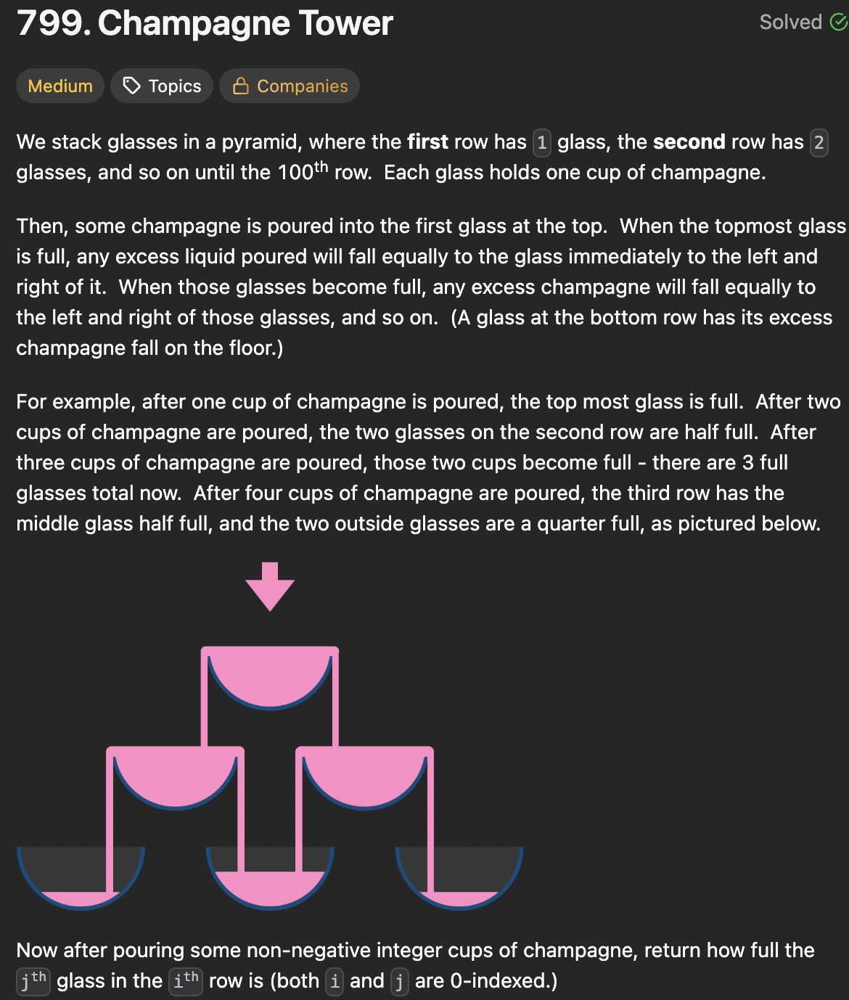

# LeetCode 799 - Champagne Tower

**类型**：dynamic programming
**难度**：Medium
**错误次数**：2
**错误原因**：模拟香槟流动的过程想不清楚，不知道当前位置该站在哪一层

---

## 一、题目描述（截图）



---

## 二、解题思路

1. 要考虑流经每个杯子的香槟量，而这个流量可以通过top-down的动态规划方法一层一层地模拟香槟的流动得到

## 三、正确解法

```java
class Solution {
    public double champagneTower(int poured, int query_row, int query_glass) {
        // 模拟香槟的流动
        // f[row][col]表示流过[row, col]这个位置的香槟总量
        double[][] f = new double[query_row + 2][query_row + 2];
        f[0][0] = poured;
        for (int row = 0; row <= query_row; row++) {
            for (int col = 0; col <= row; col++) {
                // 用推的方式自然模拟香槟流向
                if (f[row][col] > 1.0) {
                    double overflow = (f[row][col] - 1) / 2;
                    f[row][col] = 1;

                    f[row + 1][col] += overflow;
                    f[row + 1][col + 1] += overflow;
                }
            }
        }
        return f[query_row][query_glass];
    }
}
```

---

## 四、容易踩坑点

- [ ] dp数组容量的初始化，应该比query_row大2.
