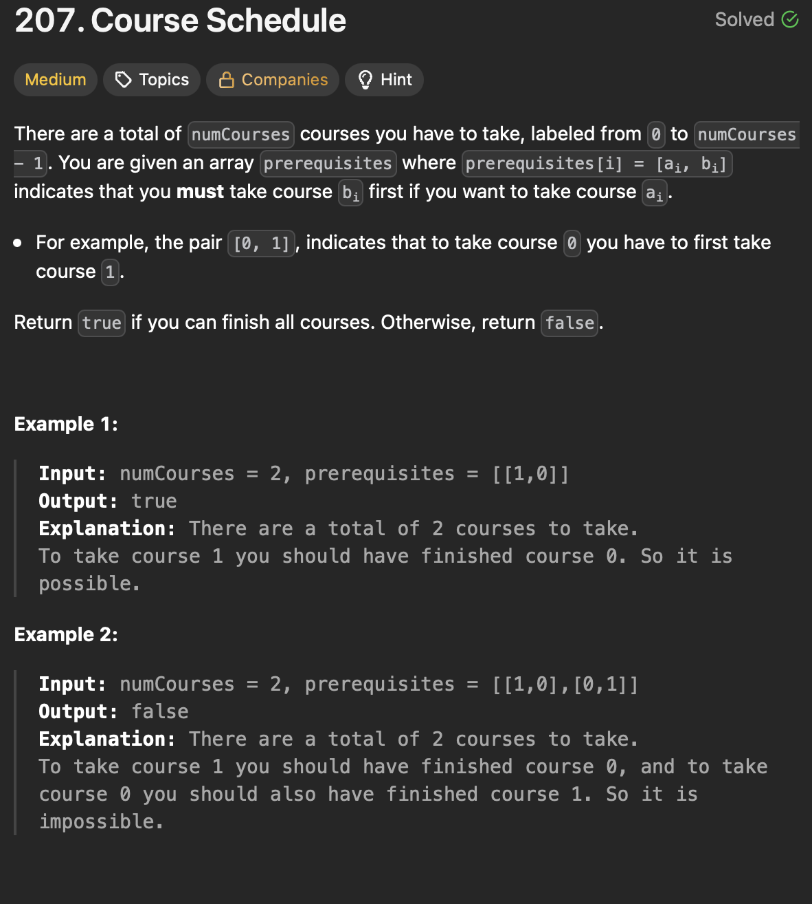

# LeetCode 207 - Course Schedule

**类型**：Graph
**难度**：Medium  
**错误次数**：1

---

## 一、题目描述（截图）



---

## 二、解题思路

1. 将课程关系构建成有向图
2. 计算每个点即课程的前置课程数量（in-degree，有多少边指向这个点）
3. 将所有前置课程数量为零的课程放入队列中，再依次取出并更新与该课程有前置课程关系的课程的前置课程数量

## 三、正确解法

```java
class Solution {
    public boolean canFinish(int numCourses, int[][] prerequisites) {
        int[] inDegree = new int[numCourses];
        List<Integer>[] graph = new ArrayList[numCourses];
        for (int i = 0; i < numCourses; i++) {
            graph[i] = new ArrayList<>();
        }

        for (int[] prerequisite : prerequisites) {
            int from = prerequisite[0];
            int to = prerequisite[1];
            inDegree[to]++;
            graph[from].add(to);
        }

        Queue<Integer> que = new ArrayDeque<>();
        for (int i = 0; i < numCourses; i++) {
            if (inDegree[i] == 0) {
                que.offer(i);
            }
        }
        int courseTaken = 0;
        while (!que.isEmpty()) {
            int currentCourse = que.poll();
            courseTaken++;
            for (int neighbor : graph[currentCourse]) {
                inDegree[neighbor]--;
                if (inDegree[neighbor] == 0) {
                    que.offer(neighbor);
                }
            }
        }
        return courseTaken == numCourses;
    }
}
```

---

## 四、容易踩坑点

- [ ] 在遍历每个点的 in-degree 时，只将第一个 in-degree 的点放入队列中，如果课程之间都没有前置关系，这样队列在弹出这个点时由于无法将其他点放入队列导致最后结果错误
