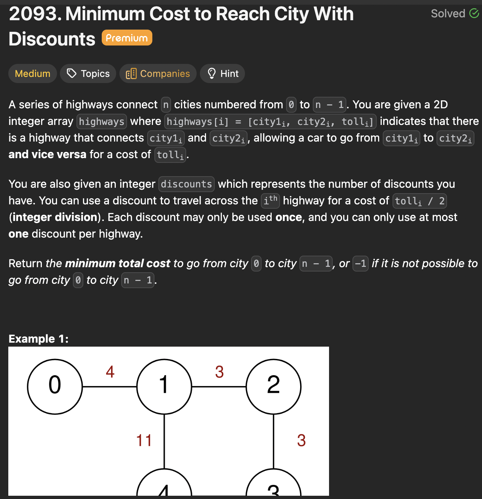

# LeetCode 2093 - Minimum Cost To Reach City With Discounts

**类型**：Graph
**难度**：Medium  
**错误次数**：1

---

## 一、题目描述（截图）



---

## 二、解题思路

1. dijkstras 算法的变种，除了维护到每个点的最短距离，还维护用了多少次折扣
2. 当我们找到了用当前折扣次到当前节点的最短距离时，更新下一个相邻节点有两种选择：用折扣和不用折扣

## 三、正确解法

```java
class Solution {
    public int minimumCost(int n, int[][] highways, int discounts) {
        List<int[]>[] graph = new List[n];
        for (int i = 0; i < n; i++) {
            graph[i] = new ArrayList<>();
        }

        for (int[] highway : highways) {
            int city1 = highway[0];
            int city2 = highway[1];
            int toll = highway[2];
            graph[city1].add(new int[]{city2, toll});
            graph[city2].add(new int[]{city1, toll});
        }

        // [cost, city, discountsUsed]
        PriorityQueue<int[]> minHeap = new PriorityQueue<>((a, b) -> a[0] - b[0]);
        minHeap.offer(new int[]{0, 0, 0});

        // Distance array: dist[city][discountsUsed] = minimum cost to reach city with exactly discountsUsed
        int[][] distance = new int[n][discounts + 1];
        for (int[] row : distance) {
            Arrays.fill(row, Integer.MAX_VALUE);
        }

        while (!minHeap.isEmpty()) {
            int[] current = minHeap.poll();
            int currentCost = current[0];
            int currentCity = current[1];
            int discountsUsed = current[2];

            if (discountsUsed > discounts || currentCost >= distance[currentCity][discountsUsed]) {
                continue;
            }
            if (currentCity == n - 1) {
                return currentCost;
            }
            distance[currentCity][discountsUsed] = currentCost;

            for (int[] neighbor : graph[currentCity]) {
                int nextCity = neighbor[0];
                int tollCost = neighbor[1];

                minHeap.offer(new int[]{currentCost + tollCost, nextCity, discountsUsed});
                minHeap.offer(new int[]{currentCost + tollCost / 2, nextCity, discountsUsed + 1});
            }
        }
        return -1;
    }
}
```

---

## 四、容易踩坑点

- [ ] 忘记更新到当前节点的最短距离
