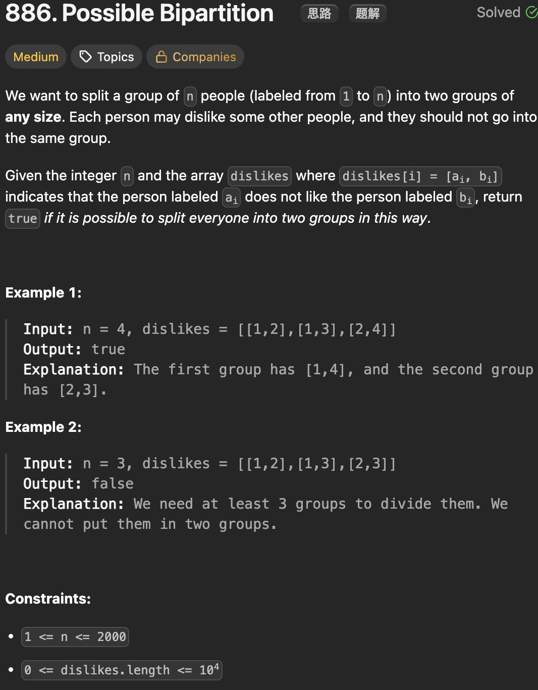

# LeetCode 886 - Possible Bipartition

**类型**：Graph
**难度**：Medium  
**错误原因**：在用bfs方法时，没有考虑未连通分量

---

## 一、题目描述（截图）



---

## 二、解题思路

1. 本题相当于二分图的判定
2. 将dislikes构建成图，用两种颜色对节点进行着色，相邻节点需要用不同的颜色
3. 用bfs或者dfs遍历图，如果相邻节点颜色相同则返回false

## 三、正确解法

```java
// bfs
class Solution {
    public boolean possibleBipartition(int n, int[][] dislikes) {
        // 用0和1表示两种颜色
        Map<Integer, List<Integer>> graph = new HashMap<>();
        for (int[] dislike : dislikes) {
            graph.computeIfAbsent(dislike[0], k -> new ArrayList<>()).add(dislike[1]);
            graph.computeIfAbsent(dislike[1], k -> new ArrayList<>()).add(dislike[0]);
        }
        Set<Integer> visited = new HashSet<>();
        Queue<Integer> que = new ArrayDeque<>();
        int[] color = new int[n + 1];
        for (int i = 1; i <= n; i++) {
            if (!visited.contains(i)) {
                visited.add(i);
                que.offer(i);
                color[i] = 0;
                while (!que.isEmpty()) {
                    int cur = que.poll();
                    for (int neighbor : graph.getOrDefault(cur, new ArrayList<>())) {
                        if (!visited.contains(neighbor)) {
                            color[neighbor] = 1 - color[cur];
                            visited.add(neighbor);
                            que.offer(neighbor);
                        } else {
                            if (color[neighbor] == color[cur]) {
                                return false;
                            }
                        }
                    }
                }
            }
        }
        return true;
    }
}
// dfs
class Solution {
    public boolean possibleBipartition(int n, int[][] dislikes) {
        // build graph
        List<Integer>[] graph = new List[n + 1];

        Arrays.setAll(graph,  index -> new ArrayList<>());
        for (int[] edge : dislikes) {
            int nodeV = edge[0];
            int nodeW = edge[1];
            graph[nodeV].add(nodeW);
            graph[nodeW].add(nodeV);
        }
        // 0 is unvisited, color has two choices 1 and 2
        int[] colors = new int[n + 1];

        for (int node = 1; node <= n; node++) {
            if (colors[node] == 0) {
                if (!dfs(graph, colors, node, 1)) {
                    return false;
                }
            }
        }
        return true;
    }

    private boolean dfs(List<Integer>[] graph, int[] colors, int node, int color) {
        colors[node] = color;
        for (int neighbor : graph[node]) {
            if (colors[neighbor] == color) {
                return false;
            }
            if (colors[neighbor] == 0 && !dfs(graph, colors, neighbor, 3 - color)) {
                return false;
            }
        }
        return true;
    }
}
```

---

## 四、容易踩坑点

- [ ] 用bfs时需要在外层套一个循环来保证所有节点都遍历到，因为可能存在未连通分量
