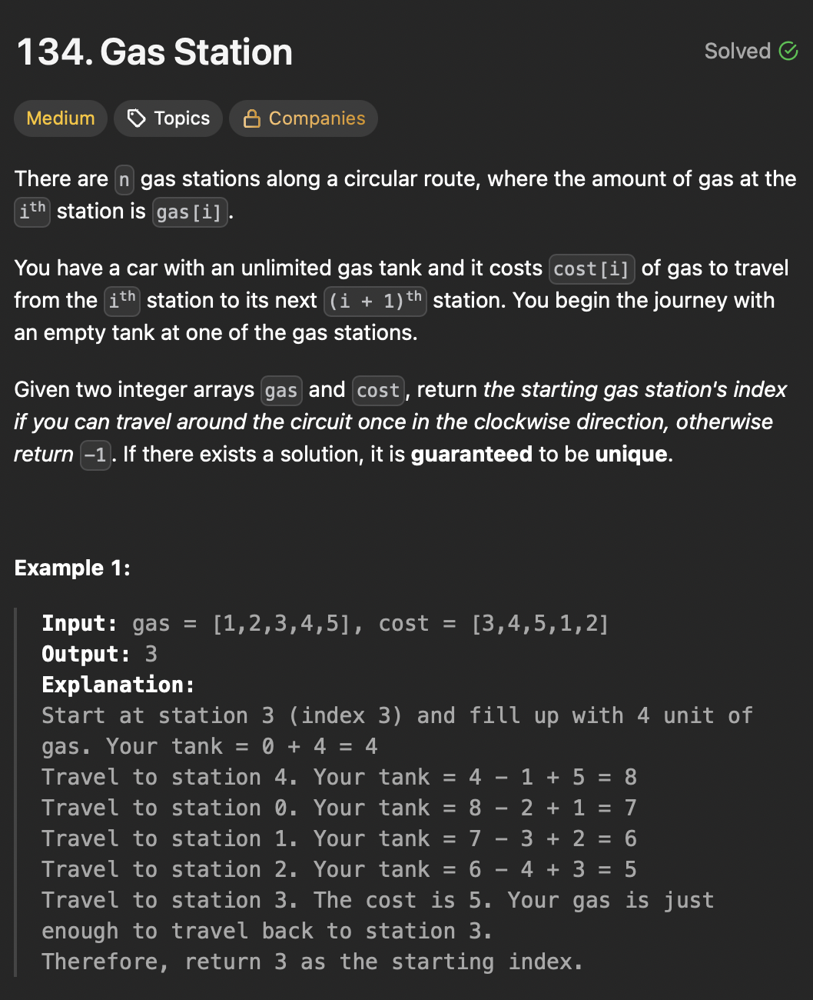

# LeetCode 134 - Gas Station

**类型**：greedy
**难度**：Medium  
**错误次数**：2

---

## 一、题目描述（截图）



---

## 二、解题思路

1. 记录每个站点的剩余油量，如果 < 0 那就不能从这之前的站点出发，起点从下一个站点开始
2. 如果所有站点的剩余油量总和 < 0，那就说明不管从哪个站点开始都无法走完全程

## 三、正确解法

```java
class Solution {
    public int canCompleteCircuit(int[] gas, int[] cost) {
        int totalSum = 0;
        int currentSum = 0;
        int start = 0;
        for (int i = 0; i < gas.length; i++) {
            totalSum += gas[i] - cost[i];
            currentSum += gas[i] - cost[i];
            if (currentSum < 0) {
                start = i + 1;
                currentSum = 0;
            }
        }
        if (totalSum < 0) return -1;
        return start;

    }
}

// 双指针解法，如果当前结束站点的油量为负数，那就需要更早开始来储存一些油量
class Solution {
    public int canCompleteCircuit(int[] gas, int[] cost) {
        int n = gas.length;

        int startIndex = n - 1;
        int endIndex = n - 1;
        int stationProcessed = 0;
        int gasBalance = 0;
        while (stationProcessed < n) {
            gasBalance += gas[endIndex] - cost[endIndex];
            stationProcessed++;
            endIndex = (endIndex + 1) % n;

            while (gasBalance < 0 && stationProcessed < n){
                startIndex--;
                gasBalance += gas[startIndex] - cost[startIndex];
                stationProcessed++;
            }
        }
        if (gasBalance < 0) return -1;
        return startIndex;
    }
}
```

---
