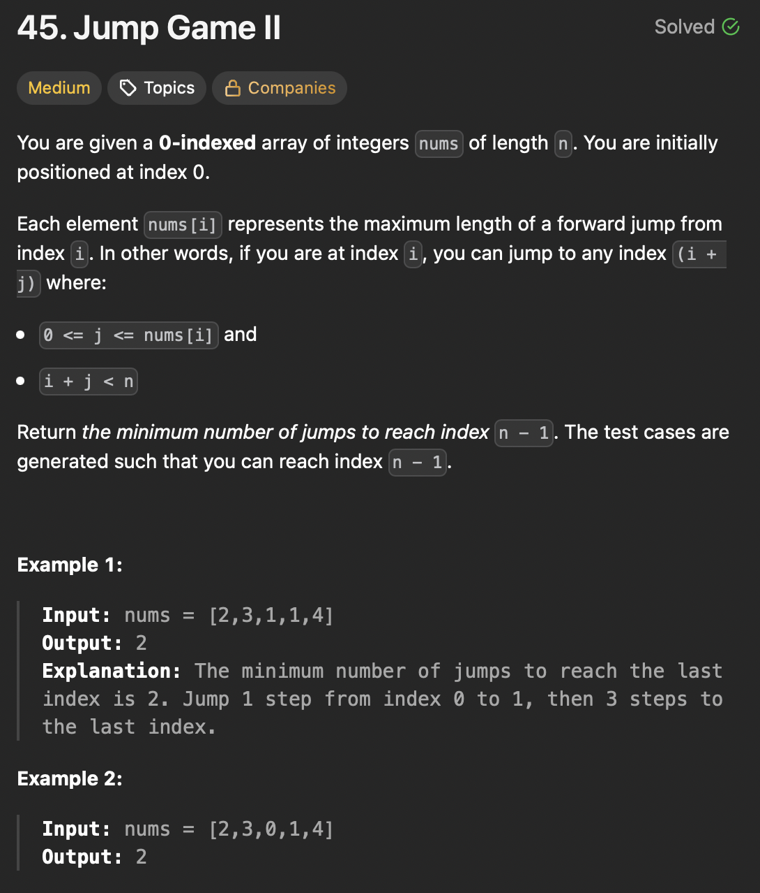

# LeetCode 45 - Jump Game II

**类型**：greedy
**难度**：Medium  
**错误次数**：1

---

## 一、题目描述（截图）



---

## 二、解题思路

1. 必须要跳一步的话，那就从当前覆盖范围内跳到最远能跳到的位置
2. 每跳一步就更新这一步可以覆盖到的最远范围
3. 在覆盖范围内去寻找下一步可以跳到的最远距离
4. 当前的位置已经到达了当前覆盖的最远范围但是还没有到达终点那就要再跳一步

## 三、正确解法

```java
class Solution {
    public int jump(int[] nums) {
        int count = 0;
        int maxReachable = 0;
        int currentJumpEnd = 0;

        for (int i = 0; i < nums.length - 1; i++){
            maxReachable = Math.max(maxReachable, i + nums[i]);
            // reach to the end of current max coverage, have to make another jump
            if (i == currentJumpEnd) {
                count++;
                currentJumpEnd = maxReachable;
                if (currentJumpEnd >= nums.length - 1) {
                    break;
                }
            }
        }
        return count;
    }
}
```

---

## 四、容易踩坑点

- [ ] 用最小的跳跃次数覆盖最远的范围
- [ ] 不要纠结具体怎么跳以及跳到哪里
