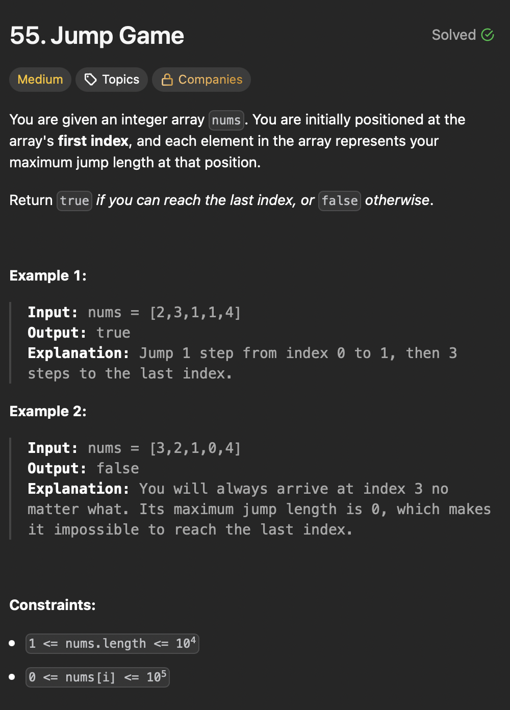

# LeetCode 55 - Jump Game

**类型**：greedy
**难度**：Medium  
**错误次数**：2

---

## 一、题目描述（截图）



---

## 二、解题思路

1. 想成是覆盖范围的问题
2. 每到一个位置就思考两个问题：能否到达这个位置，如果能那能否跳更远

## 三、正确解法

```java
class Solution {
    public boolean canJump(int[] nums) {
        int reachable = 0;
        for (int i = 0; i < nums.length; i++) {
            // ask if can reach this position
            if (i > reachable) {
                return false;
            }
            // ask if reachable can be extended
            reachable = Math.max(reachable, i + nums[i]);
        }
        return true;
    }
}
```

---

## 四、容易踩坑点

- [ ] 第一个位置的跳跃次数为零的情况，还要分为位置长度为 1 和大于 1 的情况
- [ ] 中间某个位置的跳跃次数为零的情况，如果最远已到达且无法再往前跳
