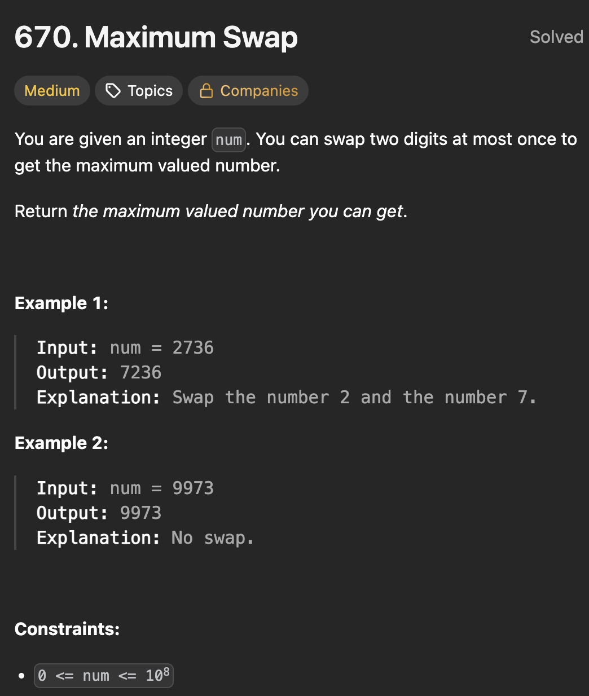

# LeetCode 670 - Maximum Swap

**类型**：greedy
**难度**：Medium

---

## 一、题目描述（截图）



---

## 二、解题思路

1. 对于每一个位置，如果右边有比它更大的数，那么把他们交换可以使这个数变大
2. 只有一次交换机会，所以应该找到左边第一个可以交换的
3. 如果右边有两个相同的最大数，那么应该把最右边的交换过来，这样整体数的减小才更少

## 三、正确解法

```java
class Solution {
    public int maximumSwap(int num) {
        char[] digits = String.valueOf(num).toCharArray();
        int len = digits.length;
        // 从当前位开始到最右边的最大数字的索引
        int[] maxIndexToRight = new int[len];
        for (int i = 0; i < len; i++) {
            maxIndexToRight[i] = i;
        }
        for (int i = len - 2; i >= 0; i--) {
            if (digits[i] <= digits[maxIndexToRight[i + 1]]) {
                maxIndexToRight[i] = maxIndexToRight[i + 1];
            }
        }

        for (int i = 0; i < len; i++) {
            int maxIndex = maxIndexToRight[i];
            if (digits[i] < digits[maxIndex]) {
                char temp = digits[i];
                digits[i] = digits[maxIndex];
                digits[maxIndex] = temp;
                break;
            }
        }
        return Integer.parseInt(String.valueOf(digits));
    }
}

```

---

## 四、容易踩坑点

- [ ] 从右边遍历找右边最大数的时候，应该包括当前位的数，遇到相同的情况要保留最右边的索引，因为做右边的索引交换后对整个数的变化最小
