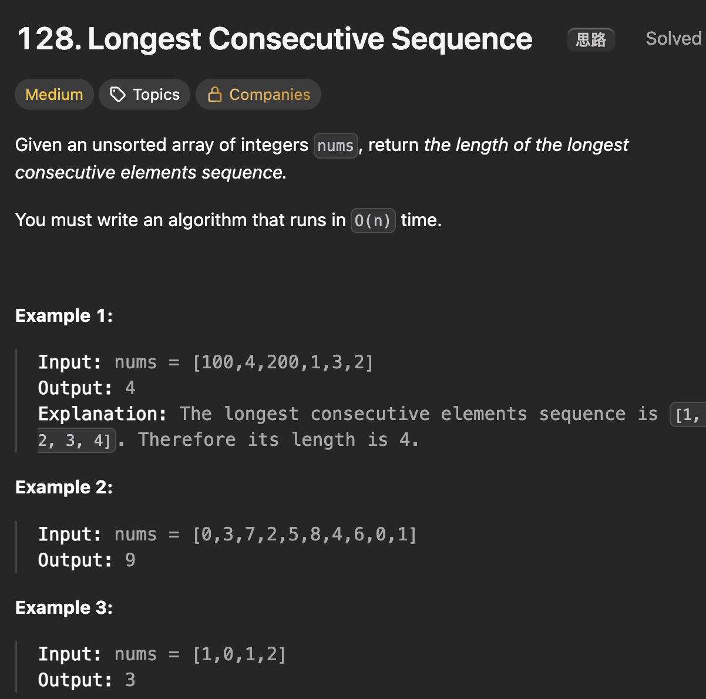

# LeetCode 128 - Longest Consecutive Sequence

**类型**：Hash Table
**难度**：Medium  
**错误次数**：2

---

## 一、题目描述（截图）



---

## 二、解题思路

1. 用哈希表能快速找到所需要的数

## 三、正确解法

```java
class Solution {
    public int longestConsecutive(int[] nums) {
        // 关键要找到连续序列的第一个数
        // 用哈希表能快速查找
        // 如果某个数没有比它小1的数，那它就可能是第一个数
        Set<Integer> numSet = new HashSet<>();

        for (int num : nums) {
            numSet.add(num);
        }

        int result = 0;
        for (int num : numSet) {
            if (numSet.contains(num - 1)) {
                continue;
            }

            int cur = num;
            int curLen = 0;
            while (numSet.contains(cur)) {
                curLen++;
                cur++;
            }
            result = Math.max(result, curLen);
        }
        return result;
    }
}

class Solution2 {
    // 找每个数可以延续的长度
    // 为避免重复计算，可以将两端连续长度连接起来
    // 比如上一段结束到y - 1
    // 那么加上以y为起点的延续长度就可以了
    public int longestConsecutive(int[] nums) {
        Set<Integer> numSet = new HashSet<>();
        for (int num : nums) {
            numSet.add(num);
        }

        int result = 0;
        Map<Integer, Integer> lenMap = new HashMap<>();
        for (int num : nums) {
            int cur = num;

            while (numSet.contains(cur)) {
                numSet.remove(cur);
                cur++;
            }

            int len = cur - num + lenMap.getOrDefault(cur, 0);
            lenMap.put(num, len);
            result = Math.max(result, len);
        }
        return result;
    }
}
```

---

## 四、容易踩坑点

- [ ] 第二种方法中对于已经计算过长度的数要及时将它从set中移除出去
