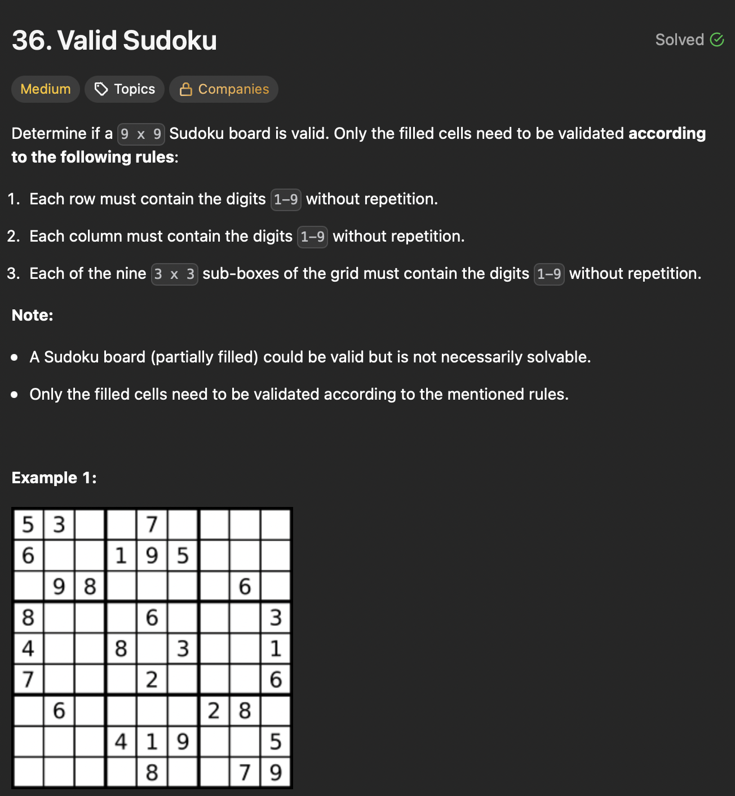

# LeetCode 36 - Valid Sudoku

**类型**：Hash Table
**难度**：Medium  
**错误次数**：1  
**第一次做错原因**：字母转换成数字直接减去整数 1（char digit - 1）

---

## 一、题目描述（截图）



---

## 二、解题思路

1. 用一个二维布尔数组记录出现过的数字
2. 将 sub-boxes 映射成 0-8，根据坐标计算出属于的 box 编号

## 三、正确解法

```java
class Solution {
    public boolean isValidSudoku(char[][] board) {
        boolean[][] rows = new boolean[9][9];
        boolean[][] cols = new boolean[9][9];
        boolean[][] subBoxes = new boolean[9][9];

        for (int row = 0; row < 9; row++) {
            for (int col = 0; col < 9; col++) {
                if (board[row][col] == '.') {
                    continue;
                }
                int digitIndex = board[row][col] - '0' - 1;
                int subBoxIndex = (row / 3) * 3 + (col / 3);
                if (rows[row][digitIndex] || cols[col][digitIndex] || subBoxes[subBoxIndex][digitIndex]) {
                    return false;
                }
                rows[row][digitIndex] = true;
                cols[col][digitIndex] = true;
                subBoxes[subBoxIndex][digitIndex] = true;
            }
        }
        return true;
    }
}

```

---

## 四、容易踩坑点

- [ ] 用一位数组去记录出现过的数字，这样需要遍历整个 board 很多遍
- [ ] digitIndex 因为是 0-based index，需要减去 1，这之前需要先将字母转换成数字
