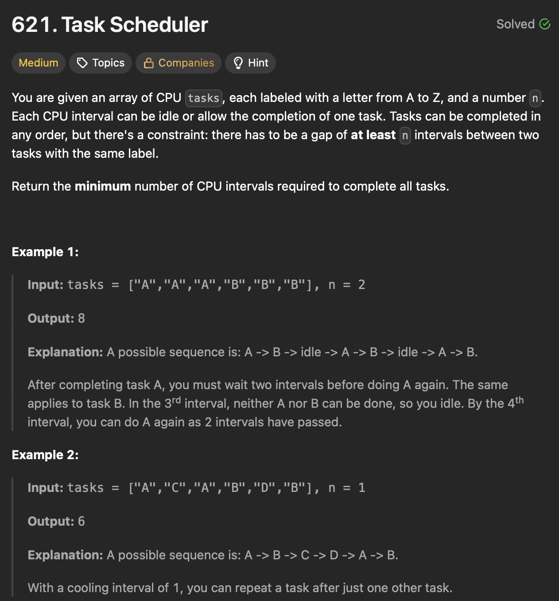

# LeetCode 621 - Task Scheduler

**类型**：Hash Table
**难度**：Medium  
**错误次数**：1  
**第一次做错原因**：思路不对

---

## 一、题目描述（截图）



---

## 二、解题思路

1. 需要的最少间隔由频率最高的任务决定
2. 用`block` 来表示一个任务到下一个重复的任务之前的间隔，需要`n + 1 slots`
3. 最后一个任务不需要冷却期，直接在总间隔数上加`1`
4. 如果有多个任务`S`有相同的最高频率，那安排他们紧跟在后面，再在最后加上`S`
5. 特殊情景：如果任务种类足够多，那这些 idle 的间隔就可以填上

## 三、正确解法

```java
class Solution {
    public int leastInterval(char[] tasks, int n) {
        int[] taskFrequencies = new int[26];
        int maxFreq = 0;
        for (char task : tasks) {
            int index = task - 'A';
            taskFrequencies[index]++;
            maxFreq = Math.max(maxFreq, taskFrequencies[index]);
        }
        int taskWithMaxFreq = 0;
        for (int i = 0; i < 26; i++) {
            if (taskFrequencies[i] == maxFreq) {
                taskWithMaxFreq++;
            }
        }
        int slotsForMaxFreq = (maxFreq - 1) * (n + 1) + taskWithMaxFreq;
        // 种类足够多由任务长度决定，不需要idle
        // 否则由最高频率任务决定
        int result = Math.max(slotsForMaxFreq, tasks.length);
        return result;
    }
}

```

---

## 四、容易踩坑点

- [ ] 如果任务种类很多，那按照最高频率任务计算出来的总间隔数可能会少于任务长度，因为所有的空闲间隔都被填满了但还是不够
