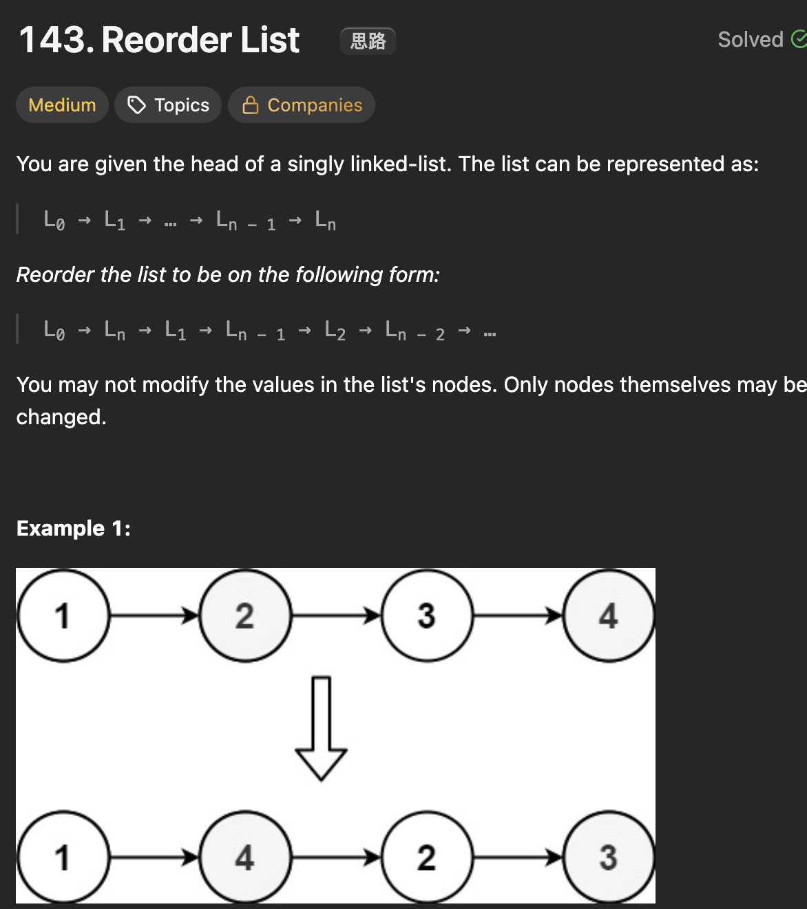

# LeetCode 143 - Reorder List

**类型**：linked list
**难度**：Medium
**错误次数**：1

---

## 一、题目描述（截图）



---

## 二、解题思路

1. 思路一：找到后半段链条，再将后半段链条反转，之后将前后半段链条合并；
2. 思路二：用栈来存储链条，利用其先进后出的性质就能从后向前遍历链条

## 三、正确解法

```java
// 思路一
class Solution {
    public void reorderList(ListNode head) {
        // 找到中点
        ListNode fast = head;
        ListNode slow = head;

        // 如果是偶数个，中点是中间两个的前面一个
        while (fast.next != null && fast.next.next != null) {
            fast = fast.next.next;
            slow = slow.next;
        }

        // 反转后半段的链条
        ListNode secondHalfHead = slow.next;
        // 切断两半段链条之间的联系
        slow.next = null;
        ListNode cur = secondHalfHead;
        ListNode prev = null;
        while (cur != null) {
            ListNode nextTemp = cur.next;
            cur.next = prev;
            prev = cur;
            cur = nextTemp;
        }
        secondHalfHead = prev;

        // merge two halfs
        ListNode firstHalfHead = head;
        while (secondHalfHead != null) {
            ListNode secondHalfNext = secondHalfHead.next;
            ListNode firstHalfNext = firstHalfHead.next;
            firstHalfHead.next = secondHalfHead;
            secondHalfHead.next = firstHalfNext;
            firstHalfHead = firstHalfNext;
            secondHalfHead = secondHalfNext;
        }
    }
}
// 思路二
class Solution {
    public void reorderList(ListNode head) {
        Deque<ListNode> stack = new ArrayDeque<>();
        // 把所有节点装进栈里，得到倒序结果
        ListNode p = head;
        while (p != null) {
            stack.push(p);
            p = p.next;
        }
        p = head;

        while (p != null) {
            ListNode lastNode = stack.pop();
            ListNode next = p.next;
            if (lastNode == next || lastNode.next == next) {
                lastNode.next = null;
                break;
            }
            p.next = lastNode;
            lastNode.next = next;
            p = next;
        }
    }
}
```

---

## 四、容易踩坑点

- [ ] 思路一中要注意前后半段链条的断开
- [ ] 思路二中注意在哪里结束合并
