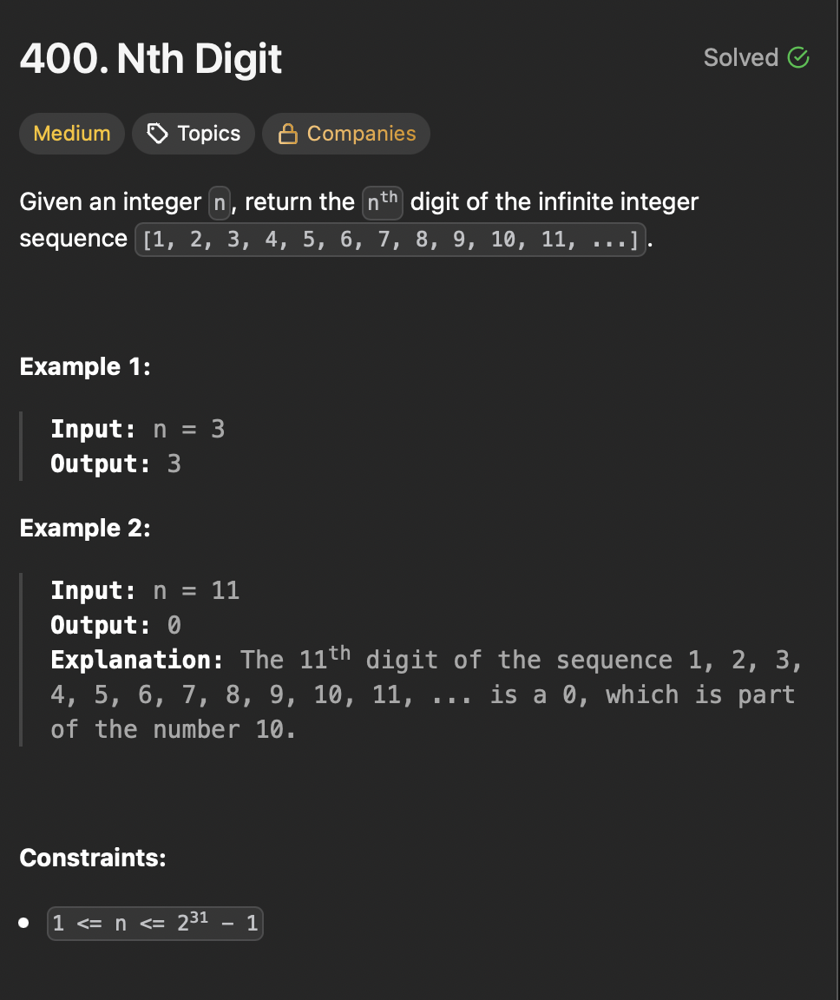

# LeetCode 400 - Nth Digit

**类型**：math
**难度**：Medium
**错误次数**：1
**错误原因**：整数溢出

---

## 一、题目描述（截图）



---

## 二、解题思路

1. 找规律，1～9有9个数，有1*9位，10～99 有90个数，有2*90位，100～999有900个数，有3\*900位
2. 先找到这个位处在的数有多少位
3. 再通过offset找到所处在的数
4. 最后确定在这个数中具体位于哪一位

## 三、正确解法

```java
class Solution {
    public int findNthDigit(int n) {
        int digits = 1;
        // 当n=1000000000,count * digit 会整型溢出
        long count = 9;
        while (digits * count < n) {
            n -= digits * count;
            digits++;
            count *= 10;
        }
        // find the exact number in current group
        // first number in current group: 10^(digits - 1), offset: (n - 1) / digits
        int number = (int)Math.pow(10, digits - 1) + (n - 1) / digits;
        // extract the position
        int index = (n - 1) % digits;
        String numString = String.valueOf(number);
        return numString.charAt(index) - '0';
    }
}
```

---

## 四、容易踩坑点

- [ ] 当位数较大时，个数也比较大，它们的乘积会超过整数的最大数，因此需要将count设置为long.
