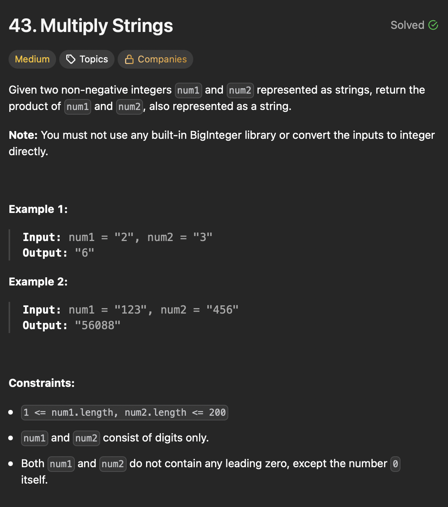

# LeetCode 43 - Multiply String

**类型**：math
**难度**：Medium
**错误次数**：1

---

## 一、题目描述（截图）



---

## 二、解题思路

1. nums1[i] 表示数字10^(m-1-i), nums2[j] 表示数字10^(n-1-j)
2. 他们的乘积将生成数字10^(m+n-2-i-j), 对应到结果的位置为（i+j+1）

## 三、正确解法

```java
class Solution {
    public String multiply(String num1, String num2) {
        // edge case
        if ("0".equals(num1) || "0".equals(num2)) {
            return "0";
        }

        int length1 = num1.length();
        int length2 = num2.length();

        // product array, product of m-digit and n-digit numbers has at most (m + n)digits
        int[] productArray = new int[length1 + length2];

        for (int i = length1 - 1; i >= 0; i--) {
            int digit1 = num1.charAt(i) - '0';
            for (int j = length2 - 1; j >= 0; j--) {
                int digit2 = num2.charAt(j) - '0';
                // product of position i in num1 and position j in num2 map to i + j + 1
                productArray[i + j + 1] += digit1 * digit2;
            }
        }

        // handle carries
        for (int i = productArray.length - 1; i >= 1; i--) {
            productArray[i - 1] += productArray[i] / 10;
            productArray[i] = productArray[i] % 10;
        }
        // skip leading zero(product might have one less digit then maximum)
        int startIndex = productArray[0] == 0 ? 1 : 0;
        StringBuilder result = new StringBuilder();
        for (int i = startIndex; i < productArray.length; i++) {
            result.append(productArray[i]);
        }
        return result.toString();
    }
}
```

---

## 四、容易踩坑点

- [ ] 两个数的乘积的位数最多有两个数的位数总和
