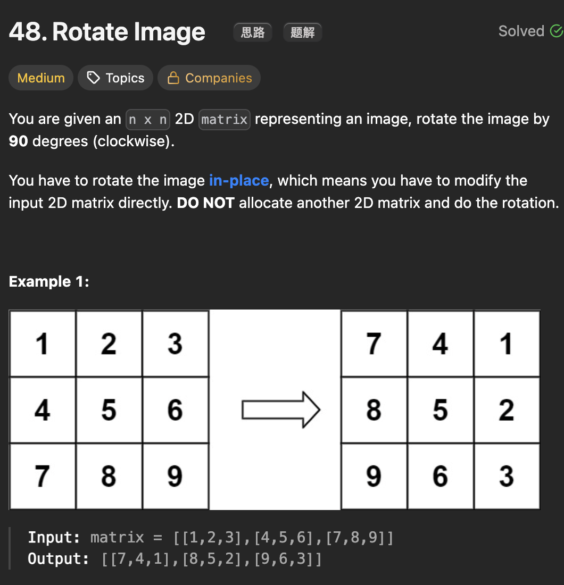

# LeetCode 48 - Rotate Image

**类型**：math
**难度**：Medium

---

## 一、题目描述（截图）



---

## 二、解题思路

1. 看作一层一层地旋转
2. 在每一层中，以四个位置的数为一组进行互换位置
3. 旋转是顺时针进行的，为了节省临时变量的开销，互换可以逆时针操作

## 三、正确解法

```java
class Solution {
    public void rotate(int[][] matrix) {
        // 一层一层地旋转，由外到内
        // 对于每一层，四个位置为一组进行旋转
        // 为了节约临时变量开销，可进行逆时针旋转
        int left = 0, right = matrix.length - 1;

        while (left < right) {
            for (int i = 0; i < right - left; i++) {
                int top = left, bottom = right;
                // save top left
                int topLeft = matrix[top][left + i];

                // move bottom left to top left
                matrix[top][left + i] = matrix[bottom - i][left];

                // move bottom right to bottom left
                matrix[bottom - i][left] = matrix[bottom][right - i];

                // move top right to bottom right
                matrix[bottom][right - i] = matrix[top + i][right];

                // move top left to top right
                matrix[top + i][right] = topLeft;

            }
            left++;
            right--;
        }

        return;
    }
}
```

---

## 四、容易踩坑点

- [ ] 每一层的循环次数是right - left（从 left 到right - 1）
