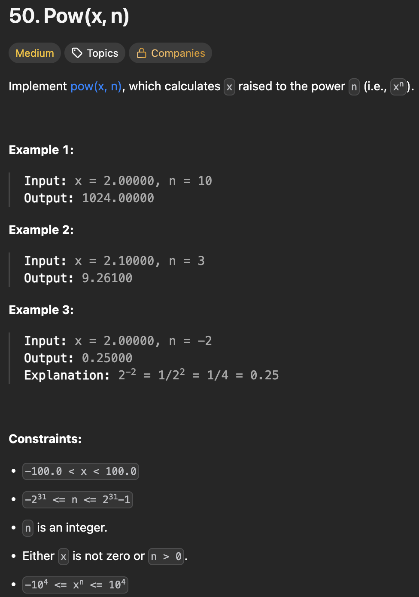

# LeetCode 50 - Pow(x, n)

**类型**：math
**难度**：Medium

---

## 一、题目描述（截图）



---

## 二、解题思路

1. 指数逐层减半（递归，自顶向下），利用x^n = (x^2){n/2}
2. 快速幂算法：将指数拆解成二进制，从低位开始计算，遇到1表示需要将当前的基数乘入结果

## 三、正确解法

```java
// 指数逐层减半
class Solution {
    public double myPow(double x, int n) {
        double res = helper(x, Math.abs((long)n));
        if (n >= 0) return res;
        else return 1 / res;
    }

    // n >= 0
    private double helper(double x, long n) {
        // base case
        if (x == 0) {
            return 0;
        }
        if (n == 0) {
            return 1;
        }

        double res = helper(x, n / 2);
        res = res * res;
        if (n % 2 == 0) {
            return res;
        } else {
            return x * res;
        }
    }
}
// 快速幂
class Solution {
    public double myPow(double x, int n) {
        // fast power
        return n >= 0 ? quickPower(x, n) : 1.0 / quickPower(x, -(long)n);
    }

    private double quickPower(double base, long exponent) {
        double result = 1.0;

        while (exponent > 0) {
            if ((exponent & 1) == 1) {
                result = result * base;
            }

            base *= base;
            exponent >>= 1;
        }
        return result;
    }
}

```

---

## 四、容易踩坑点

- [ ] 由于n的取值可能为Integer.MIN_VALUE,将其转化为正整数可能超过Integer的取值范围，需要将其转成long
