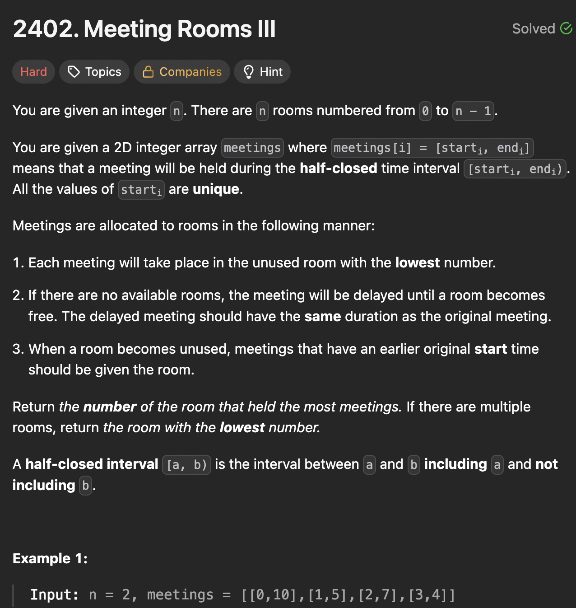

# LeetCode 2402 - Meeting Rooms III

**类型**：priority queue
**难度**：hard
**错误次数**：1
**错误原因**：只用了一个优先级队列来对所有房间排序，状态混乱

---

## 一、题目描述（截图）



---

## 二、解题思路

1. 将空闲房间和使用中的房间分别用一个优先级队列来排序
2. 遍历会议时首先检查下有没房间可以空出来，及时回收空闲房间
3. 有空闲房间先用空闲房间，没有再从使用中的房间挑选

## 三、正确解法

```java
class Solution {
    public int mostBooked(int n, int[][] meetings) {
        // 先对这些会议安装起始时间进行排序
        Arrays.sort(meetings, (a, b) -> Integer.compare(a[0], b[0]));
        // 用一个优先级队列来表示空闲空间堆，需要最小堆
        PriorityQueue<Integer> unused = new PriorityQueue<>();
        // 用另一个优先级队列来表示使用中的房间，队列里的元素用int[], 其中int[0]表示当前房间的结束时间, int[1]表示当前房间的房间号
        PriorityQueue<long[]> inuse = new PriorityQueue<>((a, b) -> {
            if (a[0] != b[0]) {
                return Long.compare(a[0], b[0]);
            }
            return Long.compare(a[1], b[1]);
        })  ;

        int[] counts = new int[n];
        for (int i = 0; i < n; i++) {
            unused.offer(i);
        }


        for (int i = 0; i < meetings.length; i++) {
            int[] meeting = meetings[i];
            int start = meeting[0];
            // 使用中的房间如果在这个会议开始前已经结束了，那可以挪到空闲房间堆里
            while (!inuse.isEmpty() && inuse.peek()[0] <= start) {
                long[] room = inuse.poll();
                unused.offer((int)room[1]);
            }

            // 如果有空闲房间，优先选择房间号最小的房间
            if (unused.size() > 0) {
                int roomNumber = unused.poll();
                inuse.offer(new long[]{meeting[1], roomNumber});
                counts[roomNumber]++;
            } else {
                // 找出最先结束的房间
                long[] top = inuse.poll();
                long end = top[0];
                long roomNumber = top[1];
                // 安排当前会议在这个房间并重新入队列
                inuse.offer(new long[]{end + (meeting[1] - meeting[0]), roomNumber});
                counts[(int)roomNumber]++;
            }

        }

        int result = 0;
        int maxCounts = 0;

        for (int i = 0; i < n; i++) {
            if (counts[i] > maxCounts) {
                result = i;
                maxCounts = counts[i];
            }
        }
        return result;
    }
}
```

---

## 四、容易踩坑点

- [ ] 会议如果不断后延，可能会出现整型溢出，需要用long来表示结束时间
