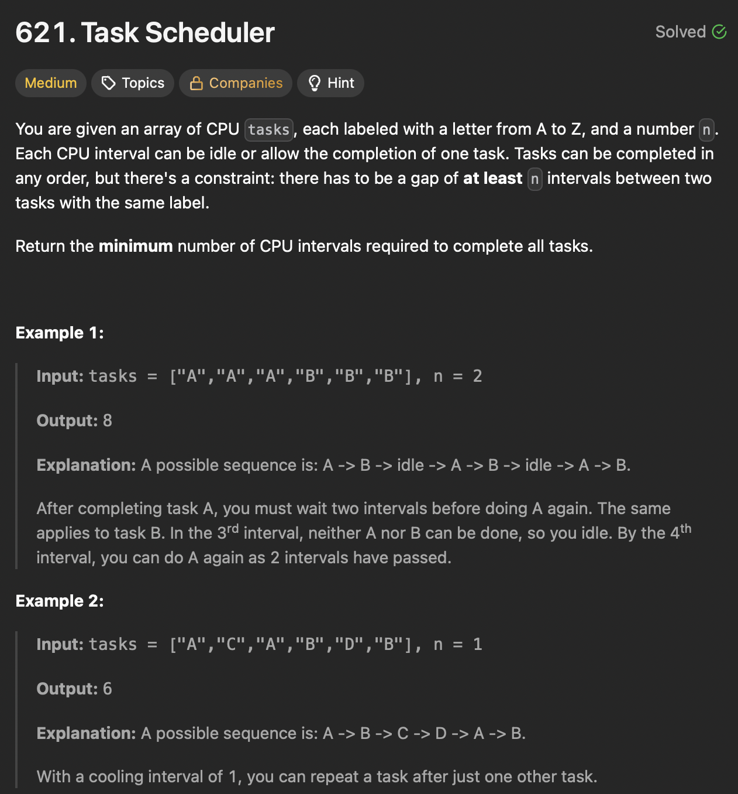

# LeetCode 2402 - Meeting Rooms III

**类型**：priority queue
**难度**：medium

---

## 一、题目描述（截图）



---

## 二、解题思路

1. 优先处理频率高的任务，可以用优先级队列来存放每个任务的频率
2. 相同的任务直接需要间隔n，可以用一个队列来存放对应任务的下一个可利用时间，如果时间满足了可以再将它放入优先级队列

## 三、正确解法

```java
class Solution {
    public int leastInterval(char[] tasks, int n) {
        // schedule most frequent task first
        int[] count = new int[26];
        for (char c : tasks) {
            count[c - 'A']++;
        }

        PriorityQueue<Integer> maxHeap = new PriorityQueue<>(Collections.reverseOrder());
        for (int cnt : count) {
            if (cnt > 0) {
                maxHeap.offer(cnt);
            }
        }
        int time = 0;
        // int[0] refers to remaining count, int[1] refers to next avaible time
        Queue<int[]> que = new LinkedList<>();
        while (!maxHeap.isEmpty() || !que.isEmpty()) {
            // process a task each ietration
            time++;

            if (!maxHeap.isEmpty()) {
                int cnt = maxHeap.poll();
                cnt--;
                if (cnt > 0) {
                    que.offer(new int[]{cnt, time + n});
                }
            }
            if (!que.isEmpty() && que.peek()[1] == time) {
                maxHeap.offer(que.poll()[0]);
            }
        }

        return time;
    }
}
```

---

## 四、容易踩坑点

- [ ] cnt只有大于0时才放入优先级队列
- [ ] 队列里的时间如果到了及时放入优先级队列
