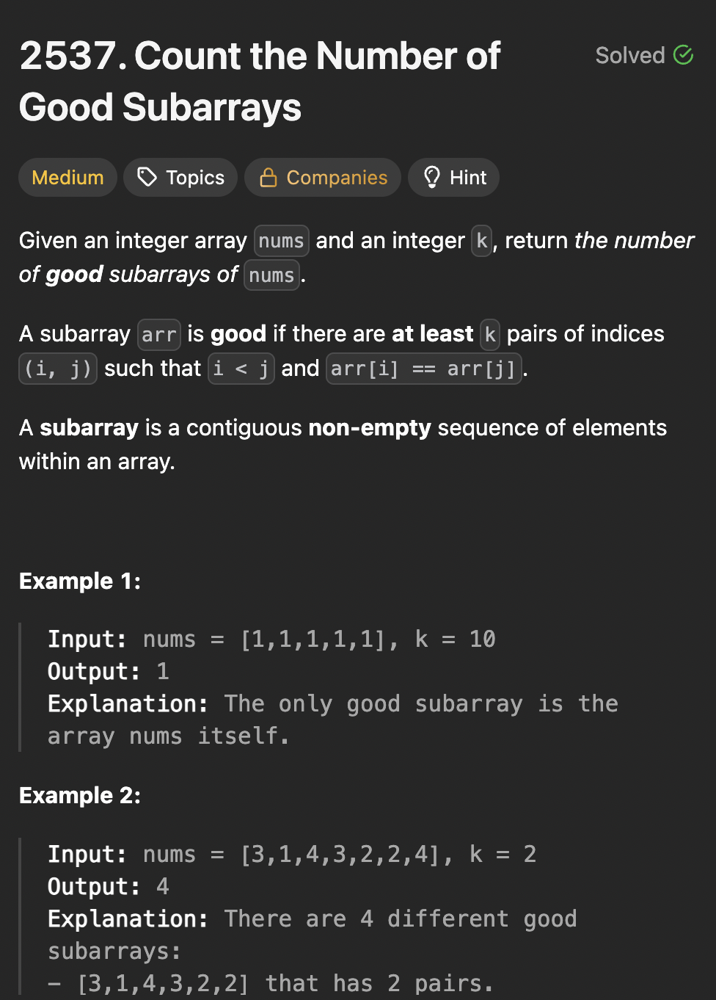

# LeetCode 2537 - Count the Number of Good Subarrays

**类型**：sliding window
**难度**：median
**错误次数**：1
**错误原因**：窗口伸缩时用组合公式处理pair增减，复杂了，而且容易出错

---

## 一、题目描述（截图）



---

## 二、解题思路

1. 满足某种条件的subarray问题首先想到滑动窗口
2. 用滑动窗口来记录相等数的对数
3. 对数没有达到k对就扩张窗口，超过k对了就缩小窗口

## 三、正确解法

```java
class Solution {
    public long countGood(int[] nums, int k) {
        // 用滑动窗口来记录pairs
        // pairs不够k就继续延伸
        // pairs达到k对了就缩小窗口
        Map<Integer, Integer> window = new HashMap<>();
        long count = 0;
        int left = 0, right = 0;
        long result = 0;
        while (right < nums.length) {
            int num = nums[right];
            right++;
            int freq = window.getOrDefault(num, 0);
            count += freq;
            window.put(num, freq + 1);

            // 缩小窗口
            while (count >= k) {
                result += nums.length - right + 1;
                int a = nums[left];
                int f = window.get(a);
                count -= f - 1;

                window.put(a, f - 1);
                left++;
            }
        }

        return result;
    }
}
```

---

## 四、容易踩坑点

- [] 题解的count增减方式：freq每增加一次，那count数就对应增加 freq - 1（这里freq是放进窗口后的总数），因为新增加的这个会和之前窗口里已有的每个都新增一个pair，减同理
