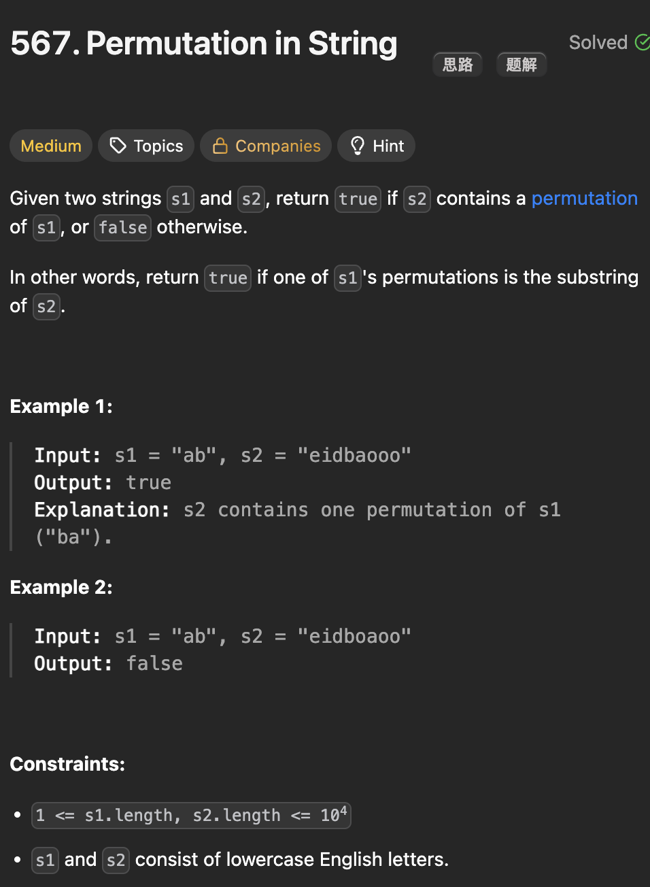

# LeetCode 567 - Permutation in String

**类型**：sliding window
**难度**：median

---

## 一、题目描述（截图）



---

## 二、解题思路

1. substring或subarray问题首先想到滑动窗口
2. 在s2中找到一个连续的子串，它与s1的组成相同
3. 在s2中维护一个与s1长度一样的固定窗口
4. 关键在于比较两个窗口中是否含有一样的元素以及元素个数

## 三、正确解法

```java
class Solution {
    public boolean checkInclusion(String s1, String s2) {
        if (s1.length() > s2.length()) return false;

        // matain a fixed length sliding window
        int[] s1Count = new int[26];
        int[] s2Count = new int[26];
        int matches = 0;
        // initial window
        for (int i = 0; i < s1.length(); i++) {
            s1Count[s1.charAt(i) - 'a']++;
            s2Count[s2.charAt(i) - 'a']++;
        }
        for (int i = 0; i < 26; i++) {
            if (s1Count[i] == s2Count[i]) {
                matches++;
            }
        }

        // move and update window
        int left = 0;
        for (int right = s1.length(); right < s2.length(); right++) {
            if (matches == 26) return true;

            // add right position to window
            int index = s2.charAt(right) - 'a';
            s2Count[index]++;
            // add right will affact matches
            if (s2Count[index] == s1Count[index]) {
                matches++;
            } else if (s2Count[index] - 1 == s1Count[index]) {
                matches--;
            }

            // remove left will also affect matches
            index = s2.charAt(left) - 'a';
            s2Count[index]--;
            if (s2Count[index] == s1Count[index]) {
                matches++;
            } else if (s2Count[index] + 1 == s1Count[index]) {
                matches--;
            }
            left++;
        }
        return matches == 26;
    }
}

```

---

## 四、容易踩坑点

- [] 注意窗口扩大或者缩小时候里面元素变化如何影响与结果相关的参数
