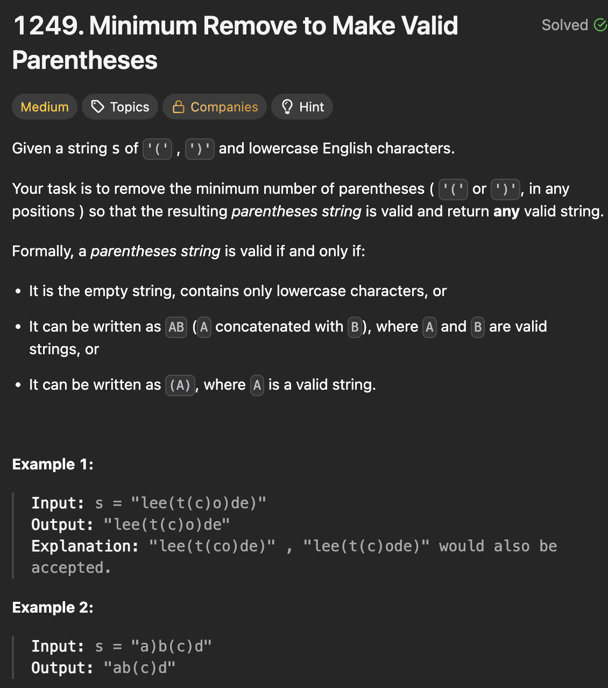

# LeetCode 1249 - Minimum Remove to Make Valid Parantheses

**类型**：stack
**难度**：median

---

## 一、题目描述（截图）



---

## 二、解题思路

1. 这道题的难点在于怎么去除多余的括号
2. 对于有效的括号，必须满足两个条件，每个左括号必须有一个右括号在它之后，每个右括号必须有一个左括号且在它之前
3. 两遍遍历，从左向右遍历找出多余的右括号，再从右向左找出多余的左括号

## 三、正确解法

```java
class Solution {
    public String minRemoveToMakeValid(String s) {
        // 从左向右遍历，删去多余的')'
        // 再从右向左遍历，删去多余的'('
        // stack里存储保留的字符
        Deque<Character> stack = new ArrayDeque<>();
        int unmatchedOpenCount = 0;

        for (char c : s.toCharArray()) {
            if (c == ')' && unmatchedOpenCount == 0) {
                continue;
            }
            if (c == '(') {
                unmatchedOpenCount++;
            } else if (c == ')') {
                unmatchedOpenCount--;
            }
            stack.push(c);
        }

        StringBuilder sb = new StringBuilder();
        unmatchedOpenCount = 0;
        // 利用stack后进先出的性质来倒序遍历
        while (!stack.isEmpty()) {
            char c = stack.pop();
            if (c == '(' && unmatchedOpenCount == 0) {
                continue;
            }
            if (c == ')') {
                unmatchedOpenCount++;
            } else if (c == '(') {
                unmatchedOpenCount--;
            }
            sb.append(c);
        }
        return sb.reverse().toString();
    }
}
```

---

## 四、容易踩坑点

- []
