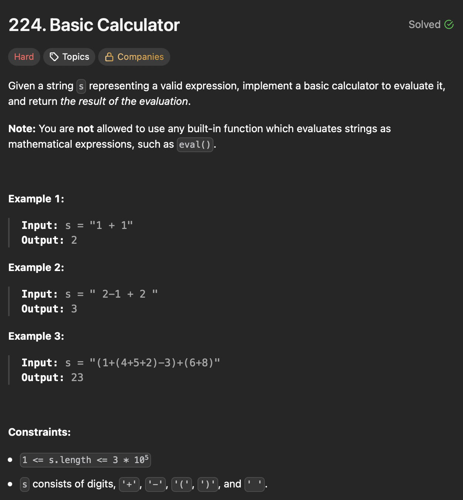

# LeetCode 224 - Basic Calculator

**类型**：stack
**难度**：hard
**错误次数**：1
**错误原因**：while loop处理完digits忘记更新外面for loop的 counter i

---

## 一、题目描述（截图）



---

## 二、解题思路

1. 需要处理括号，在遇到开括号时需要记住之前的状态（结果）和运算符（+ 还是 -），可以用栈来保存这些信息
2. 遇到开括号就要进行一个新的计算，遇到闭括号就可以将这个新的计算结果与之前的状态结合
3. 此时需要从栈里弹出两次，一次为之前的结果一次为开括号前的运算符

## 三、正确解法

```java
class Solution {
    public int calculate(String s) {
        Deque<Integer> stack = new ArrayDeque<>();
        int result = 0;
        int sign = 1;

        for (int i = 0; i < s.length(); i++) {
            char currentChar = s.charAt(i);

            if (Character.isDigit(currentChar)) {
                int startIndex = i;
                int number = 0;
                while (startIndex < s.length() && Character.isDigit(s.charAt(startIndex))) {
                    number = number * 10 + (s.charAt(startIndex) - '0');
                    startIndex++;
                }
                result += sign * number;

                // update loop counter to skip processed digits
                i = startIndex - 1;
            } else if (currentChar == '+') {
                sign = 1;
            } else if (currentChar == '-') {
                sign = -1;
            } else if (currentChar == '(') {
                stack.push(result);
                stack.push(sign);
                result = 0;
                sign = 1;
            } else if (currentChar == ')') {
                result = stack.pop() * result + stack.pop();
            }
        }
        return result;
    }
}
```

---

## 四、容易踩坑点

- [ ] 遇到数字时用while loop 找出完整的数，为了避免和之前的index混淆，可以设一个新的index，并找完数后用它来更新之前的index
- [ ] 遇到括号要记住之前的结果和对括号计算结果的操作符
- [ ] 每遇到一个开括号就意味着要进行一个sub-expression的计算
