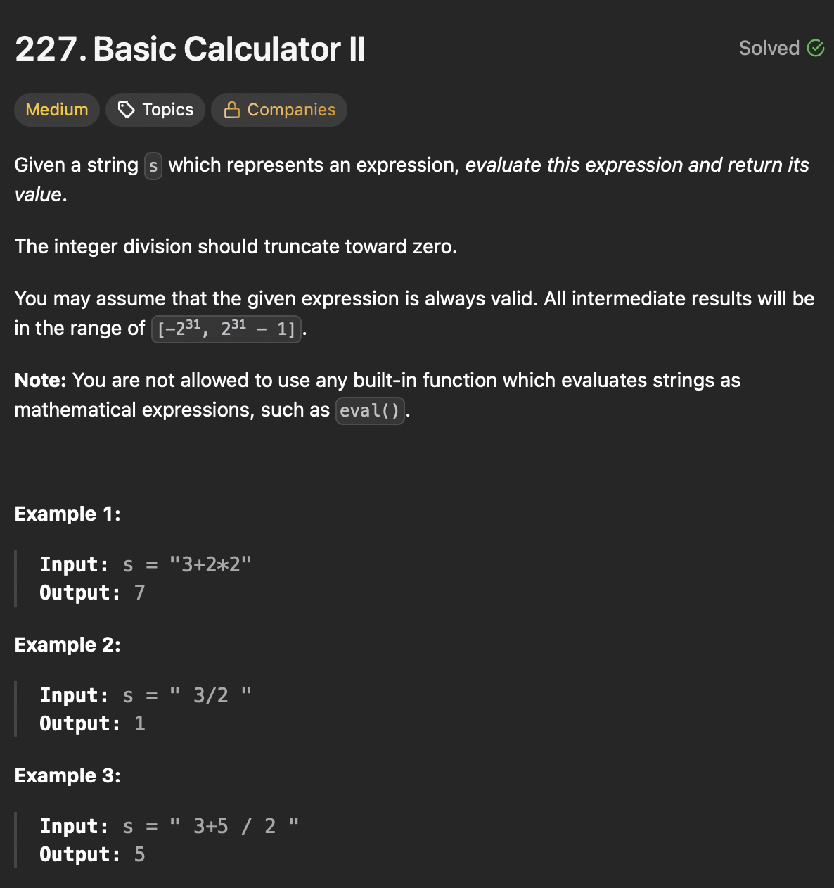

# LeetCode 227 - Basic Calculator II

**类型**：stack
**难度**：Medium
**错误次数**：1

---

## 一、题目描述（截图）



---

## 二、解题思路

1. 用栈来存储最后需要相加的数字，这里将负数转换成加法处理
2. 在遍历字符时如果遇到数字就构造对应位数的数，如果遇到符合就表示已经构造完一个数
3. 需要对这个数进行处理，处理方式要看它之前的符号，将处理结果再放回栈中
4. 最后对栈中所有的元素进行加和

## 三、正确解法

```java
class Solution {
    public int calculate(String s) {
        Deque<Integer> stack = new ArrayDeque<>();
        char operator = '+';
        int currentNumber = 0;
        for (int i = 0; i < s.length(); i++) {
            char c = s.charAt(i);
            if (Character.isDigit(c)) {
                currentNumber = currentNumber * 10 + (c - '0');
            }
            if (i == s.length() - 1 || c == '+' || c == '-' || c == '*'|| c == '/') {
                if (operator == '+') {
                    stack.push(currentNumber);
                } else if (operator == '-') {
                    stack.push(-currentNumber);
                } else if (operator == '*') {
                    stack.push(stack.pop() * currentNumber);
                } else {
                    stack.push(stack.pop() / currentNumber);
                }
                operator = c;
                currentNumber = 0;
            }
        }
        int result = 0;
        while (!stack.isEmpty()) {
            result += stack.pop();
        }
        return result;
    }
}
```

---

## 四、容易踩坑点

- [ ] 如果将运算符也放入栈中那就会增加代码复杂性
- [ ] 构造出一个完整的数后向前处理，因为运算符需要两个操作数，需要的前一个数从栈里取出来即可
