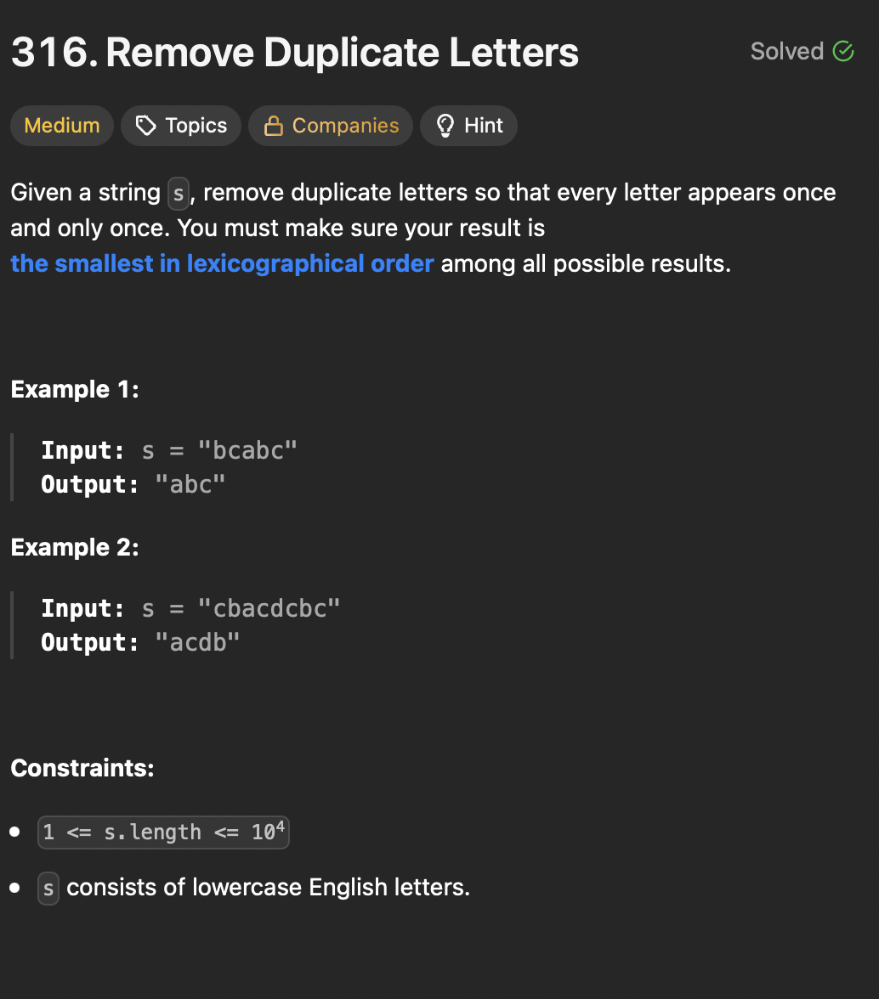

# LeetCode 316 - Remove Duplicate Letters

**类型**：stack
**难度**：median
**错误次数**：1
**错误原因**：当遇到重复字母时简单地只将其与上一次出现的位置比较从而确定删除哪个位置

---

## 一、题目描述（截图）



---

## 二、解题思路

1. 当我们遍历每个字母时可以想一想是否可以把它放在更好的位置通过删除出现在它前面的并比它大的字母，前提是这些字母在后面还会出现
2. 需要知道每个字母最后出现的位置
3. 可以用单调栈来存储当前结果

## 三、正确解法

```java
class Solution {
    public String removeDuplicateLetters(String s) {
        int n = s.length();
        int[] lastOccurence = new int[26];
        for (int i = 0; i < n; i++) {
            char c = s.charAt(i);
            lastOccurence[c - 'a'] = i;
        }

        Deque<Character> stack = new ArrayDeque<>();
        int inStackMask = 0;
        for (int i = 0; i < n; i++) {
            char c = s.charAt(i);
            if (((inStackMask >> (c - 'a')) & 1) == 1) {
                continue;
            }
            while (!stack.isEmpty() && c < stack.peek() && lastOccurence[stack.peek() - 'a'] > i) {
                inStackMask ^= 1 << (stack.pop() - 'a');
            }
            stack.push(c);
            inStackMask |= 1 << (c - 'a');
        }
        StringBuilder sb = new StringBuilder();
        while (!stack.isEmpty()) {
            sb.append(stack.pop());
        }
        return sb.reverse().toString();
    }
}
```

---

## 四、容易踩坑点

- [] 想着遍历一次就解决问题，但是这道题里需要先掌握每个字母最后出现的位置
