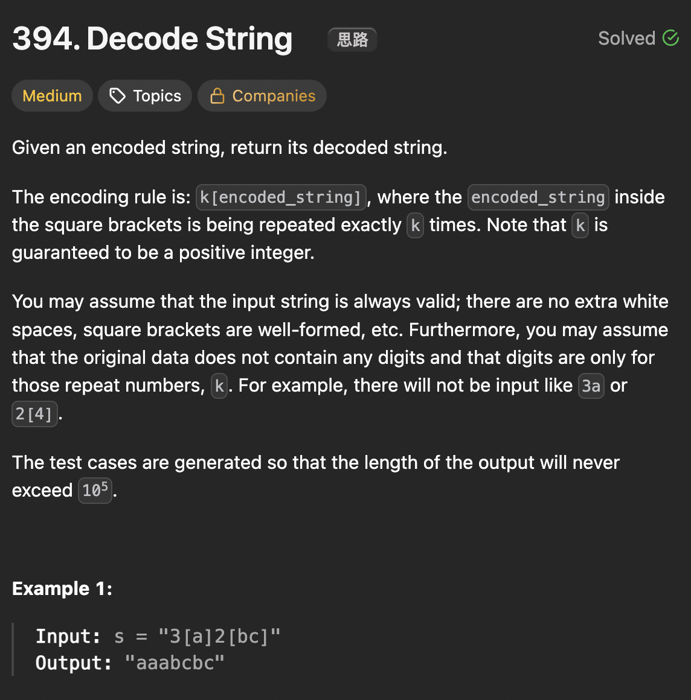

# LeetCode 227 - Basic Calculator II

**类型**：stack
**难度**：Medium
**错误次数**：2

---

## 一、题目描述（截图）



---

## 二、解题思路

1. 用一个栈来存储之前或者上一层构造的字符串
2. 用另一个栈来存储重复的次数
3. 当遇到开括号时，我们需要保存到目前为止构造的字符串
4. 同时需要保存与之对应的数字，并且开始构造当前层的新字符串
5. 当遇到闭括号时，我们需要重复当前构造的字符串并与上一层的字符串结合

## 三、正确解法

```java
class Solution {
    public String decodeString(String s) {
        // stack 存储上一层的字符串
        Deque<Integer> counts = new ArrayDeque<>();
        Deque<String> stack = new ArrayDeque<>();

        // cur 存储当前层的字符串
        StringBuilder cur = new StringBuilder();
        int num = 0;
        for (char c : s.toCharArray()) {
            if (Character.isDigit(c)) {
                num = num * 10 + (c - '0');
            } else if (c == '[') {
                stack.push(cur.toString());
                counts.push(num);
                cur = new StringBuilder();
                num = 0;
            } else if (c == ']') {
                StringBuilder sb = new StringBuilder();
                sb.append(stack.pop());

                int count = counts.pop();
                while (count > 0) {
                    sb.append(cur);
                    count--;
                }
                cur = sb;
            } else {
                cur.append(c);
            }
        }
        return cur.toString();
    }
}
```

---

## 四、容易踩坑点

- [ ] 在遇到闭括号时，构建完当前层的字符串立即push回栈中
