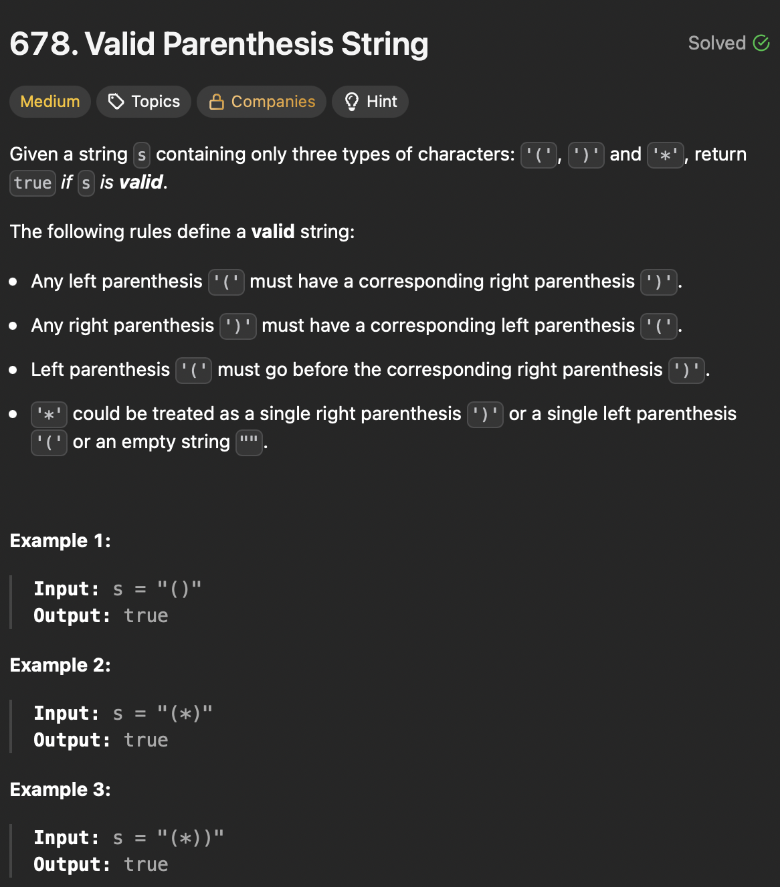

# LeetCode 678 - Valid Parenthesis String

**类型**：stack
**难度**：median
**错误次数**：1
**错误原因**：将左括号和星号同时存储在一个栈中，最后没有正确判断能否抵消

---

## 一、题目描述（截图）



---

## 二、解题思路

1. 用两个栈分别记录左括号和星号的位置
2. 如果遇到右括号优先弹出左括号
3. 遍历结束时如果两个栈都不为空，依次弹出每个栈里的元素，只有当左括号的位置在星号位置之前时才能用星号抵消掉一个左括号

## 三、正确解法

```java
class Solution {
    public boolean checkValidString(String s) {
        Deque<Integer> leftStack = new ArrayDeque<>();
        Deque<Integer> asteriskStack = new ArrayDeque<>();
        for (int i = 0; i < s.length(); i++) {
            char c = s.charAt(i);
            if (c == '(') {
                leftStack.push(i);
            } else if (c == '*') {
                asteriskStack.push(i);
            } else {
                if (!leftStack.isEmpty()) {
                    leftStack.pop();
                } else if (!asteriskStack.isEmpty()) {
                    asteriskStack.pop();
                } else {
                    return false;
                }
            }
        }
        while (!leftStack.isEmpty() && !asteriskStack.isEmpty()) {
            int leftIndex = leftStack.pop();
            int asteriskIndex = asteriskStack.pop();
            if (leftIndex > asteriskIndex) {
                return false;
            }
        }
        return leftStack.isEmpty();
    }
}
```

---

## 四、容易踩坑点

- [] 最后直接将栈里左括号的个数与星号个数进行比较，忽略了他们的相对位置
