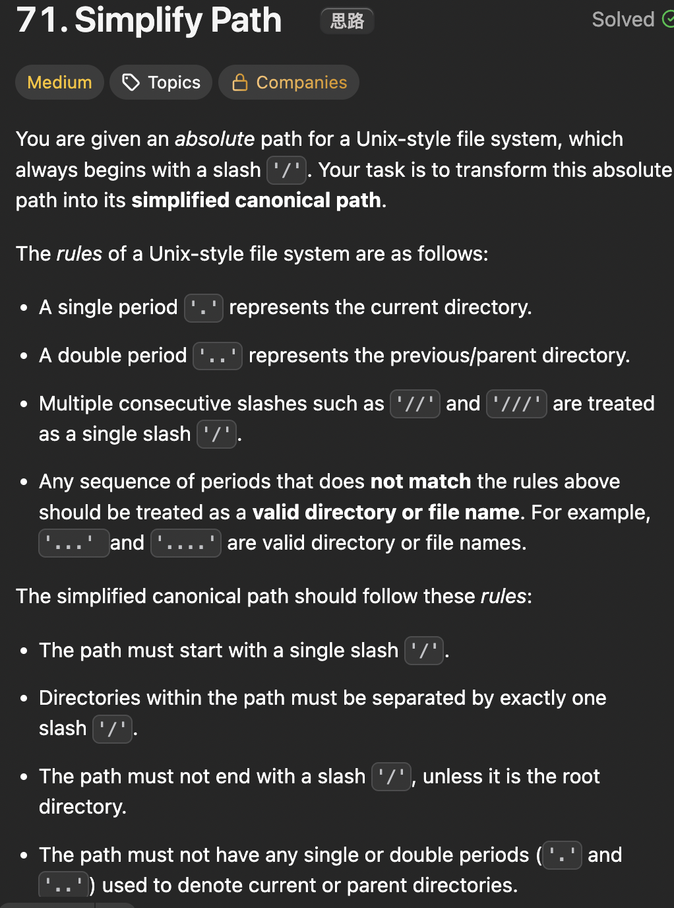

# LeetCode 71 - Simplify Path

**类型**：stack
**难度**：medium
**错误次数**：2
**错误原因**：只想到挨个处理字符，逻辑比较复杂，没有想到用split()函数

---

## 一、题目描述（截图）



---

## 二、解题思路

1. 用split("/")函数可以将path的每个文件夹或文件找出来
2. 用栈可以回到上一个文件夹

## 三、正确解法

```java
class Solution {
    public String simplifyPath(String path) {
        // java split如果在开头遇到‘/’，比如/a,那会是['', 'a']
        // 如果遇到连续的‘a//b’，会是['a', '', 'b']
        // 如果在末尾遇到‘/’，就会放弃掉
        String[] parts = path.split("/");
        Deque<String> stack = new ArrayDeque<>();
        for (String part : parts) {
            if (part.isEmpty() || part.equals(".")) {
                continue;
            }
            if (part.equals("..")) {
                if (!stack.isEmpty()) {
                    stack.pop();
                }
                continue;
            }
            stack.push(part);
        }
        String res = "";
        while (!stack.isEmpty()) {
            res = "/" + stack.pop() + res;
        }
        return res.isEmpty() ? "/" : res;
    }
}
```

---

## 四、容易踩坑点

- [ ] String.split(String regex)
