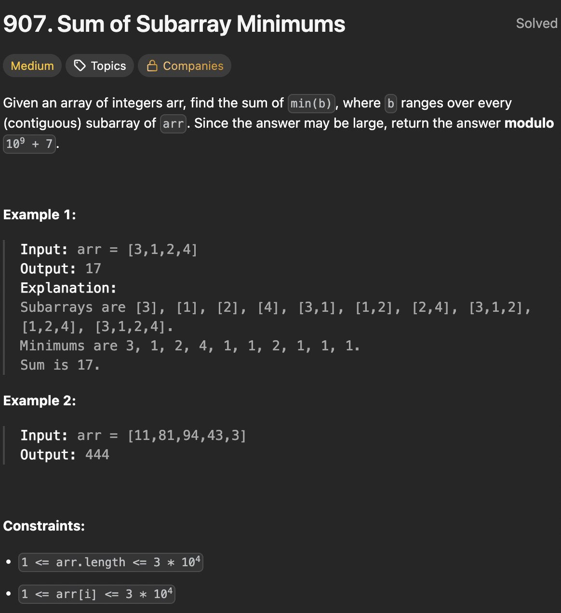

# LeetCode 907 - Sum of Subarray Minimums

**类型**：montonic stack
**难度**：medium
**错误次数**：2
**错误原因**：边界处理错误, 忘记取模

---

## 一、题目描述（截图）



---

## 二、解题思路

1. 对于数组里每个数，计算他们作为子数组里最小值的对结果值的贡献
2. 那就要计算每个数作为最小值出现在多少个子数组里

## 三、正确解法

```java
class Solution {
    public int sumSubarrayMins(int[] arr) {
        // 数组里每个值都可能是最小值
        // 每个值作为子数组里的最小值，找出这样的子数组共有多少个
        // 那就需要找出左右边界，第一个比该数值还小的数
        int n = arr.length;
        int[] rightFirstSmaller = new int[n];
        Arrays.fill(rightFirstSmaller, n);

        int[] leftFirstSmaller = new int[n];
        Arrays.fill(leftFirstSmaller, -1);

        // 栈底到栈顶是升序,栈里存的是索引
        Deque<Integer> incrStack = new ArrayDeque<>();
        for (int i = 0; i < n; i++) {
            while (!incrStack.isEmpty() && arr[incrStack.peek()] > arr[i]) {
                int top = incrStack.pop();
                rightFirstSmaller[top] = i;
            }
            if (!incrStack.isEmpty()) {
                leftFirstSmaller[i] = incrStack.peek();
            }
            incrStack.push(i);
        }

        long result = 0;
        int MOD = 1_000_000_007;
        for (int i = 0; i < n; i++) {
            // 这里左右边界表示符合条件的可选范围
            long leftBound = i - (leftFirstSmaller[i] + 1) + 1;
            long rightBound = rightFirstSmaller[i] - 1 - i + 1;
            long count = leftBound * rightBound % MOD;
            result = (result + count * arr[i]) % MOD;
        }
        return (int) result;
    }
}
```

---

## 四、容易踩坑点

- [ ] 在找左右两边第一个最小值时，两边判断条件要不对称，比如左边严格小于右边小于等于，这样对于重复数值才不会重复计算子数组个数
